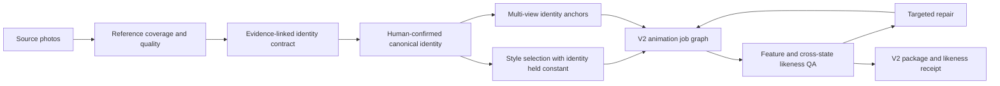
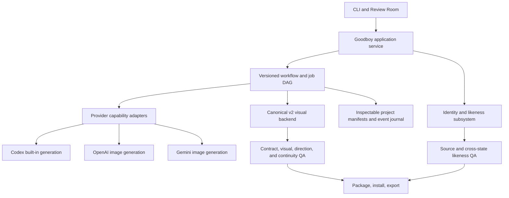

# Goodboy V2 and Next-Level Product Plan

## Executive Decision

Goodboy should continue, but its product definition must change.

It should not compete with Hatch Pet as another sprite-building recipe. It should adopt the official Codex v2 pet contract and the strongest parts of Hatch Pet's deterministic rendering and QA machinery, then compete at a higher layer:

> Hatch Pet makes a valid, attractive Codex pet. Goodboy makes **your specific pet**, proves why it resembles them, keeps that identity stable across every animation and revision, and makes the whole process recoverable and easy to control.

The central wedge should therefore be source-pet likeness. This is both emotionally meaningful to users and structurally suited to Goodboy's existing strengths: source provenance, durable projects, provider adapters, approvals, feedback branches, installation governance, and a review UI.

V2 compatibility is not the differentiator. It is the admission price.

Goodboy should claim superiority only after it can demonstrate all three of the following:

1. It produces packages that are at least as valid and visually robust as Hatch Pet.
2. In blinded comparisons, people more often judge Goodboy's output as resembling the supplied pet.
3. The extra machinery reduces total correction effort instead of creating a more complicated user experience.

The recommended strategy is:

- **Use** Hatch Pet's v2 contract and proven visual mechanics.
- **Contribute or share** deterministic backend improvements where a stable common surface is possible.
- **Vendor a pinned, attributed backend snapshot** when a shared package does not yet exist.
- **Build** Goodboy's identity, workflow, review, provider, benchmarking, and product layers.
- **Stop** maintaining Goodboy's independent v1 rendering contract.

This document is the implementation plan. The companion report, [Goodboy vs Hatch Pet Capability Validation](2026-07-16-goodboy-vs-hatch-pet-validation.md), contains the detailed current-state comparison and validation evidence.

## Implementation Result

Goodboy `0.2.0` now implements the release-critical v2 product foundation
described here:

- exact Codex pet v2 contracts and packages;
- a hash-pinned, attributed Hatch backend snapshot with conformance tests;
- evidence-linked, versioned source identity and explicit provider consent;
- dependency-aware generation, recovery, and targeted repair lineage;
- direction semantics, independent blind-direction input, and trait-level
  likeness gates;
- a Review Room backed by the same real actions as the CLI, including source
  policies, candidates, style, generation import, recovery, repair, review,
  approval, export, and explicit installation;
- source-safe project, Petdex, and diagnostic exports;
- non-destructive v1-to-v2 migration;
- a frozen, blinded, identity-clustered benchmark with claim vetoes.

A public-domain Socks pilot now exercises that product path on a second animal
with three generation references and a withheld fourth image. The frozen
Goodboy and Hatch-style arms both exhausted their repair budgets on different
direction-row failures, so no valid matched A/B bundle or superiority result
exists. An explicitly out-of-budget Goodboy continuation then demonstrated the
mechanism claim: evidence-linked review found broken waiting and active-task
semantics, targeted whole-row repair removed every animation failure, a source
audit corrected an anatomical-side error in the identity contract without
regenerating correct pixels, and the final v2 package passed technical,
direction, blind-direction, animation, and likeness gates with documented
polish warnings. Human final visual approval remains intentionally pending.

The complete protocol and results are in
`benchmark-workspaces/socks-full/2026-07-16-socks-full-animation-pilot-protocol.md`
and
`benchmark-workspaces/socks-full/2026-07-16-socks-full-animation-pilot-results.md`.

One intentionally external comparative proof obligation remains:

1. a real, consented or appropriately licensed multi-identity source-pet
   benchmark with independent reviewers and valid matched packages.

Optional live provider conformance runs using user-owned credentials remain
useful operational evidence, but they are not required to understand the local
v2 contract or the Socks mechanism result.

The cohort result cannot be honestly manufactured from synthetic fixtures or a
single diagnostic continuation. Until it passes its predeclared gates, Goodboy
withholds any empirical claim that its pets have better source likeness or
animation than Hatch Pet.

Non-release-blocking roadmap items remain deliberately deferred: a persistent
cross-project Pet Library, arbitrary third-party v2 package adoption, official
provider-SDK multi-turn sessions, a local image provider, and heavyweight
learned likeness metrics. The standalone Quick Hatch mode was narrowed out:
users who want the shortest non-identity workflow should use Hatch Pet
directly, while Goodboy stays focused on source likeness and durable projects.

The section-by-section implementation status and evidence boundaries are in
[Goodboy V2 Implementation Audit](docs/reference/2026-07-16-v2-implementation-audit.md).

Status-reading note: the sections below preserve the design rationale,
pre-v2 baseline, requirements, and delivery plan that drove the implementation.
References there to the “current” or “present” Goodboy gap describe the
pre-`0.2.0` baseline unless a section explicitly says otherwise. The
Implementation Result above and the implementation audit are the authoritative
current status.

## Direct Answer: Is the Opportunity the Likeness of a Pet From Source Images?

Yes. That should become the flagship promise.

Goodboy already asks for source images, records their hashes and provenance, creates a source card, generates alternative baselines, and carries a selected baseline into later generation. Those are useful foundations. They do **not**, however, amount to a reliable likeness system.

The present gap is substantial:

- source ingest does not automatically extract detailed identity evidence from the photos;
- the baseline prompt omits several identity fields already represented in the schema;
- candidate variations change style and interpretation at the same time, making it hard to distinguish “most like my pet” from “style I prefer”;
- animation rows use the selected baseline and layout guide, but not a systematic selection of the original identity references;
- `identity_score` can be recorded but is not computed, calibrated, or enforced;
- no feature-level likeness gate prevents an ear shape, marking, eye color, muzzle, tail, or accessory from drifting between states;
- the final QA surface verifies geometry and sprite mechanics, not whether the result is recognizably the source pet.

The correct v2 model is not “prompt from a photo.” It is:



Likeness should not be represented by one opaque number. It should be decomposed into observable traits:

- species, breed, or type;
- age and size cues;
- silhouette and body proportions;
- head and muzzle geometry;
- eye shape, color, spacing, and expression;
- nose shape and color;
- ear shape, position, asymmetry, and fold;
- coat length, texture, material, and primary colors;
- distinctive markings, including which side they appear on;
- tail shape, length, carriage, and markings;
- collar, tag, harness, clothing, or other identity-bearing props;
- habitual expression and personality cues;
- recognizability at the final small display size.

The user's approval remains the source of truth. Automated models and metrics should produce evidence and warnings, not overrule the person who knows the pet.

## What “Better Than Hatch Pet” Must Mean

Goodboy should not use “better” to mean more settings, more prompts, or more generated artifacts. It should mean a materially better user outcome.

| Dimension | Hatch Pet strength | Goodboy v2 requirement | Proof required |
|---|---|---|---|
| Codex contract | Canonical current v2 implementation | Exact v2 parity | Contract and package tests |
| Sprite visual quality | Strong extraction, registration, despill, and visual QA | Same or stronger floor | Golden fixtures and blind visual QA |
| Source likeness | Reference-led but not a durable identity product | Explicit identity contract and source-linked QA | Blinded source-likeness benchmark |
| Ease of use | Effective but agent- and shell-oriented | One guided flow with real gates | Completion time and intervention count |
| Iteration | Manual regeneration and review | Targeted, replayable repair with lineage | Recovery and repair tests |
| Provider choice | Optimized for the bundled workflow | Capability-aware Codex, OpenAI, and Gemini support | Provider conformance matrix |
| Durability | Run-oriented | Project, run, artifact, decision, and version history | Crash-recovery and migration tests |
| Review | Strong generated review artifacts | Interactive source-to-output review | End-to-end UI tests |
| Evidence | QA artifacts | QA plus a user-readable likeness receipt | Exported receipt and audit tests |
| Privacy | Depends on the active workflow | Explicit local/source/provider policy | Privacy defaults and disclosure tests |

If Goodboy cannot match Hatch Pet's v2 validity and visual floor, it is not better. If it matches the floor but fails to produce measurably stronger likeness or easier correction, it is only a more complicated wrapper.

## Verified Current Baseline

### Official Codex Pet V2 Contract

The currently bundled Hatch Pet implementation uses:

- an 8-column by 11-row atlas;
- 192 by 208 pixel cells;
- a 1536 by 2288 pixel final atlas;
- rows 0 through 8 for the existing animation states;
- rows 9 and 10 for 16 clockwise look directions;
- `"spriteVersionNumber": 2` in `pet.json`;
- cardinal-direction anchor generation and registered extended-row assembly;
- explicit directional, continuity, semantic, and independent visual QA;
- one final edge-local, linear-light despill pass on the completed atlas.

The installed user skill and bundled application skill were byte-identical at the time of this audit. Goodboy should treat that implementation as the current compatibility reference, while avoiding a permanent runtime dependency on an absolute application-bundle path.

### Pre-Implementation Goodboy Contract

Before this plan was implemented, Goodboy used a nine-row v1 contract:

- `src/goodboy/contracts.py` hard-codes nine rows and a 1536 by 1872 atlas;
- `src/goodboy/atlas.py`, `src/goodboy/raster.py`, and `src/goodboy/qa.py` assume that shape;
- `src/goodboy/pipeline.py` does not write `spriteVersionNumber`;
- `src/goodboy/style.py` plans nine independent row jobs;
- `ui/src/lib/sprite.ts` exposes nine hard-coded rows;
- project defaults persist that v1 output contract.

This is a release-blocking compatibility gap, not a small enhancement.

### Existing Goodboy Assets Worth Preserving

Goodboy already contains several pieces that are more product-like than Hatch Pet:

- durable, hashed source ingest and source manifests;
- structured source and character cards;
- multiple provider adapters;
- baseline candidate generation and selection;
- provider request and output evidence;
- review, approval, install, and export records;
- critique and feedback branch concepts;
- a higher-level `start` and `advance --agent-mode` workflow;
- a web action layer and Review Room foundation;
- strict manifest validation and a meaningful Python test suite.

The v2 project should preserve these advantages, but should not preserve incompatible v1 visual logic merely because it already exists.

## Product Positioning

### Primary Promise

> Turn a few photos into an animated Codex companion that is recognizably your pet, with a guided approval flow and a durable record of every decision.

### Primary Mode: My Pet

This is the differentiated experience and should receive most product and evaluation effort.

The user:

1. provides several source photos;
2. confirms the pet's defining traits;
3. selects the baseline that looks most like the pet;
4. chooses or refines the visual style separately;
5. reviews a multi-view identity anchor;
6. watches the v2 animation set progress through real quality gates;
7. corrects individual identity traits in plain language;
8. approves and installs the pet;
9. can later restore, revise, or regenerate it without starting over.

### Secondary Mode: Quick Hatch

This should expose the canonical v2 workflow with minimal choices. It is useful for users who want an attractive character and do not need exact source fidelity.

Quick Hatch must not fork into a separate renderer. It should use the same contract, backend, job engine, and packaging path with a lighter identity policy.

**Implementation decision:** this mode is deferred and narrowed out of `0.2.0`.
Hatch Pet already serves the short, non-identity workflow well; duplicating it
would weaken Goodboy's source-faithful wedge without adding user value.

### Later Mode: Mascot or Brand Character

The identity contract can generalize to branded mascots, fictional creatures, and designed characters. It would replace pet-specific anatomy traits with brand shape, palette, emblem, typography, and usage constraints.

This is a later extension, not a reason to dilute the pet experience now.

### Repair and Upgrade Mode

Goodboy should import:

- a complete Goodboy v1 project;
- a legacy 8 by 9 pet atlas;
- an existing v2 pet package;
- an incomplete or failed Goodboy v2 run.

It should then identify what can be safely preserved, what lacks provenance, and what needs regeneration.

## Product Principles

### 1. Identity Is a Versioned Contract

Pet identity must be a first-class project artifact, not prose copied into whichever prompt happens to run next.

### 2. Style and Identity Are Separate Decisions

A user should be able to say:

- “candidate B looks most like her,” and separately;
- “use candidate D's softer clay style.”

The system should then regenerate the style around the approved identity rather than forcing a compromise between the two.

### 3. Human Approval Is the Ground Truth

Model critiques and automated metrics are useful for triage. They cannot certify personal likeness by themselves.

### 4. Every Failure Should Be Repairable at the Right Scope

If the right ear drifts in the waving row, the user should repair the waving row or the right-ear identity trait. Goodboy should not manually paint a final atlas cell or silently mutate a package.

### 5. Goodboy Owns Orchestration; the Canonical Backend Owns Pixels

Goodboy should own durable state, provider selection, prompt compilation, decisions, repair lineage, review, benchmarking, and export. Shared or pinned canonical v2 code should own extraction, layout, registration, assembly, despill, and contract validation.

### 6. Complexity Must Be Hidden Behind Useful Gates

The normal user path remains:

```text
goodboy start
goodboy advance --agent-mode
```

The user should encounter meaningful review decisions, not internal command choreography.

### 7. Private Source Material Is Local by Default

Source photos, derived identity evidence, and generated previews remain local unless a provider request or explicit export requires them.

## Non-Goals for the V2 Upgrade

The first v2 release should not:

- train or fine-tune a custom image model;
- implement DreamBooth or LoRA infrastructure;
- build a cloud account system or collaborative SaaS;
- add dozens of visual styles before likeness works;
- create a second independent implementation of Hatch Pet's image-processing algorithms;
- add hand-drawn Pillow, SVG, canvas, or procedural fallback pets;
- patch individual final-atlas cells as an accepted repair strategy;
- claim that embedding similarity proves pet identity;
- make external provider submission implicit;
- retain v1 as an equal long-term output target.

The [DreamBooth paper](https://arxiv.org/abs/2208.12242) demonstrates why subject-driven generation from a small photo set is plausible, but also describes overfitting, context entanglement, and hallucinated feature risks. Model fine-tuning is therefore a possible future experiment, not an MVP dependency.

## Target Architecture

### Layered Design



### Goodboy Core Owns

- project and run schemas;
- source ingest, hashing, provenance, and privacy policy;
- identity traits, evidence, locking, and user confirmation;
- provider capability negotiation and request evidence;
- compiled generation briefs;
- job dependency state and recovery;
- decisions, approvals, repairs, and lineage;
- review artifacts and UI actions;
- benchmarks and quality receipts;
- install, export, and migration.

### Canonical V2 Backend Owns

- exact atlas geometry;
- guide validation;
- cell extraction;
- component selection and grouping;
- stable slot placement and centering;
- cardinal registration;
- extended look-row assembly;
- mirror-safety checks;
- background removal and final despill;
- package contract validation;
- focused direction sheets;
- continuity and semantic direction checks;
- final atlas visual QA inputs.

### Integration Preference

Use this order:

1. contribute to or consume a shared, versioned backend package;
2. if that does not exist, vendor a pinned snapshot of the relevant Hatch Pet backend and tests;
3. optionally discover an installed Hatch Pet backend at runtime;
4. keep a tested standalone fallback so Goodboy does not depend on an absolute ChatGPT application path.

Hatch Pet's current files are Apache 2.0 licensed. If code is vendored or modified, Goodboy must preserve the license, document modifications, include required attribution, and carry any applicable notice file. The MIT license of the surrounding Goodboy project does not erase those obligations.

## Versioned Output Contract

### Contract Registry

Replace global v1 constants with an explicit registry:

```text
codex-pet-v1
codex-pet-v2
```

Each contract should define:

- contract identifier and schema version;
- sprite version number;
- cell, row, column, and atlas dimensions;
- ordered animation and direction states;
- expected guide and intermediate artifacts;
- extraction and assembly backend version;
- required QA gates;
- package manifest fields;
- installer compatibility requirements.

New projects should default to `codex-pet-v2`. V1 should remain readable only for import and migration.

### Required Version Fields

Persist at least:

```json
{
  "workspace_schema_version": "0.2",
  "contract_id": "codex-pet-v2",
  "contract_version": "2.0",
  "sprite_version_number": 2,
  "backend_name": "hatch-compatible",
  "backend_version": "pinned-version-or-commit",
  "goodboy_version": "package-version"
}
```

Provider-backed artifacts should additionally record an immutable provider snapshot:

```json
{
  "provider": "openai",
  "model_alias": "gpt-image-2",
  "model_snapshot": "gpt-image-2-2026-04-21",
  "capabilities_snapshot": "sha256:...",
  "request_id": "...",
  "started_at": "...",
  "completed_at": "...",
  "latency_ms": 0,
  "usage": {},
  "estimated_cost": null
}
```

Never rewrite historical run metadata when a provider alias or capability changes.

### Schema Migration Policy

Current strict dataclass validation is valuable, but schemas must become explicitly migratable.

Implement:

- `load -> detect version -> migrate in memory -> validate current schema`;
- pure, testable migration functions;
- a migration receipt that records every change;
- copy-on-write project upgrades;
- preservation of unknown legacy data in a namespaced compatibility field rather than silent deletion;
- refusal when an unsafe or ambiguous conversion is detected.

Opening a legacy project must never destructively overwrite it without an explicit migration action.

## Project and Artifact Model

### Recommended Layout

```text
project/
  project.json
  contract.json
  sources/
    manifest.json
    originals/
    derivatives/
  identity/
    reference-coverage.json
    identity-profile.json
    trait-evidence.json
    identity-policy.json
  decisions/
    decisions.jsonl
  runs/
    <run-id>/
      run.json
      events.jsonl
      jobs/
      inputs/
      generated/
      processed/
      qa/
      review/
      package/
  exports/
  install/
```

### Source of Truth

Keep inspectable files as the durable source of truth:

- versioned JSON manifests for declared state;
- append-only JSONL for events and decisions;
- content-addressed or hashed generated artifacts;
- atomic file replacement;
- a single-writer project lock;
- a derived cache or SQLite index only if the UI later needs faster querying.

Do not make an opaque database the only representation of a pet project in v2.

### Run Lineage

Every generation or repair run should record:

- parent run;
- reason for derivation;
- identity profile version;
- contract and backend versions;
- provider snapshot;
- inherited and regenerated artifacts;
- superseded jobs;
- approvals invalidated by the change;
- final disposition.

This turns the current feedback-branch concept into real, replayable lineage.

## Workflow and Job Engine

### Why the Current Workflow Must Change

Current stage inference relies mainly on whether expected files exist. That is not sufficient for a dependency-rich v2 process with:

- canonical identity approval;
- cardinal anchors;
- two dependent look rows;
- incremental QA;
- targeted repair;
- provider retries;
- invalidated downstream approvals;
- v1-to-v2 upgrade paths.

### Job Schema

Each job should include:

```json
{
  "job_id": "row-waving-r2",
  "kind": "animation-row",
  "state": "waving",
  "depends_on": ["identity-pack-r1"],
  "status": "ready",
  "attempt": 2,
  "parent_job_id": "row-waving-r1",
  "input_artifacts": [],
  "input_roles": [],
  "compiled_brief": "...",
  "provider_snapshot": {},
  "expected_outputs": [],
  "required_gates": [],
  "invalidates": [],
  "created_at": "...",
  "updated_at": "..."
}
```

### Job States

Use explicit states:

- `planned`;
- `blocked`;
- `ready`;
- `running`;
- `generated`;
- `processing`;
- `qa_failed`;
- `awaiting_approval`;
- `approved`;
- `complete`;
- `superseded`;
- `cancelled`.

Transitions should be validated and logged. `advance` must be idempotent: running it twice after the same completed step should not duplicate provider work.

### V2 Dependency Graph

The canonical path should support up to:

1. source analysis;
2. identity confirmation;
3. baseline candidates;
4. selected canonical base;
5. multi-view/cardinal identity anchors;
6. nine standard animation rows;
7. cardinal anchor processing;
8. look row 9;
9. registered and semantic QA for look row 9;
10. look row 10;
11. registered and semantic QA for look row 10;
12. final assembly and one-time despill;
13. complete visual, direction, continuity, identity, and package QA;
14. user approval and install.

The exact order of the multi-view identity anchor is an experiment worth testing. Generating it early may improve ordinary row likeness by supplying view-specific references, while Hatch Pet currently relies primarily on the canonical base for standard rows and uses cardinals for the extended look rows. Goodboy should run an A/B benchmark before making early cardinals mandatory.

### Invalidation Rules

Examples:

- changing a style-only field invalidates generated visual artifacts but not source evidence;
- changing eye color invalidates the canonical base, identity anchors, every row, and final approval;
- changing a waving-state motion note invalidates only that row, downstream assembly, and final approval;
- replacing the backend version invalidates processed rows and QA, but may preserve raw provider outputs;
- changing look-row 9 invalidates look-row 10 when row 10 depends on row 9 for continuity.

These rules must be encoded and tested, not left to agent judgment.

### Recovery

On startup, Goodboy should:

- detect an interrupted job;
- compare event history with filesystem artifacts;
- validate hashes;
- mark a provider request as `unknown` rather than automatically rerunning when billing may have occurred;
- allow the user or agent to attach an already-generated output;
- resume deterministic processing safely;
- never silently accept a partial atlas.

## The Identity and Likeness Subsystem

This is the primary new product work.

### 1. Reference Roles

Extend source metadata with explicit roles:

- `identity_front`;
- `identity_three_quarter`;
- `identity_left`;
- `identity_right`;
- `identity_back`;
- `body_proportions`;
- `marking_detail`;
- `face_detail`;
- `tail_detail`;
- `accessory_detail`;
- `personality_reference`;
- `style_only`;
- `exclude_from_identity`.

One image may carry multiple roles. The user should be able to correct automatic classification.

### 2. Reference Quality and Coverage

For each source, record advisory quality:

- resolution;
- blur;
- crop completeness;
- occlusion;
- lighting and color cast;
- camera angle;
- visible body regions;
- whether another animal or person may confuse the model;
- whether the image is a near-duplicate;
- whether it is safe and permitted to send to each configured provider.

The onboarding UI should explain missing coverage in plain language:

> We have a clear face and front view, but no reliable view of the tail or left-side markings. Add one side or full-body photo for better likeness.

The workflow should recommend roughly three to five useful photos, not simply maximize image count. This is consistent with subject-driven generation research, but the exact Goodboy recommendation must be calibrated through its own benchmark.

### 3. Evidence-Linked Identity Profile

Replace the flat source card as the final identity representation with structured traits:

```json
{
  "trait_id": "ears.right",
  "category": "ears",
  "value": "right ear folds forward; left ear stands more upright",
  "importance": "signature",
  "symmetry": "asymmetric",
  "confidence": 0.92,
  "locked": true,
  "user_confirmed": true,
  "evidence": [
    {
      "source_id": "source-003",
      "note": "clearly visible in three-quarter view",
      "region": null
    }
  ]
}
```

Trait importance should be:

- `signature`: losing it makes the pet feel wrong;
- `important`: should remain stable, but minor stylization is acceptable;
- `supporting`: useful when visible;
- `uncertain`: not enough evidence;
- `ignore`: should not constrain generation.

The user must be able to lock, edit, demote, or remove a trait.

### 4. Automatic Source Analysis

Add a provider-neutral vision-analysis interface that:

- identifies visible traits;
- links every claim to one or more source IDs;
- distinguishes direct evidence from inference;
- calls out disagreement between photos;
- flags lighting-dependent color uncertainty;
- never invents a trait merely to fill the schema;
- emits structured data validated before it enters the project.

The first implementation can use the active multimodal model. The architecture should permit:

- Codex analysis;
- OpenAI vision analysis;
- Gemini vision analysis;
- a future local/private analyzer.

No provider should receive source photos without an explicit project policy and visible disclosure.

### 5. Human Confirmation Gate

Before baseline generation, the Review Room should show:

- each signature trait;
- the source image or images supporting it;
- uncertainty and conflicts;
- a compact source contact sheet;
- editable wording;
- “this is essential” and “do not preserve this” controls.

No exact-likeness run proceeds until the identity profile is confirmed.

### 6. Identity-Preserving Prompt Compiler

Stop building row prompts through scattered string concatenation.

Compile each generation brief from:

1. immutable identity block;
2. approved style block;
3. state or direction block;
4. physical-construction and continuity rules;
5. layout and background contract;
6. selected references and their roles;
7. explicit negative constraints;
8. provider-specific formatting.

The compiler must include identity fields currently omitted from candidate or character prompts, including eyes, nose, ears, markings, colors, size, age cues, asymmetry, and personality where relevant.

Prompt snapshots should be testable and stored with each job.

### 7. Reference Packing

Providers have different reference capabilities. Goodboy should choose the smallest useful reference pack:

- canonical base;
- best view-specific source or identity anchor;
- relevant detail reference for a signature trait;
- state layout or pose guide;
- previous output when a provider benefits from conversational continuity.

The current [OpenAI image generation guide](https://developers.openai.com/api/docs/guides/image-generation) documents multi-image references, high-fidelity image inputs for `gpt-image-2`, and conversational editing through the Responses API, while also warning that recurring-character consistency can still fail. The current [Gemini image generation documentation](https://ai.google.dev/gemini-api/docs/image-generation) documents multiple character references and recommends carrying previous outputs or pose references when consistency matters.

Goodboy should not hard-code one universal reference count. It should use a live, versioned provider-capability matrix.

### 8. Separate Likeness Selection From Style Selection

The baseline workflow should have two decisions.

First:

> Which candidate most resembles your pet?

Use pairwise comparisons against the sources, with style variation minimized.

Second:

> Which rendering treatment do you prefer?

Apply the chosen style around the approved identity.

Useful baseline strategies:

- one identity interpretation with several controlled render styles;
- one selected style with several identity corrections;
- pairwise tournament rather than six equally weighted cards;
- a “none of these” route that converts user feedback into trait-level corrections.

### 9. Identity Pack

Before animation, generate and approve:

- a canonical neutral full-body base;
- a small-size preview;
- front, left, right, and back identity anchors or an equivalent multi-view sheet;
- a source-linked marking and feature board;
- an identity comparison sheet.

The identity pack should serve both human review and provider grounding.

The multi-view anchor must pass:

- silhouette consistency;
- signature feature presence;
- left/right marking correctness;
- accessory consistency;
- scale and lower-body anchor consistency;
- source-pet approval.

### 10. State-Aware Identity Rules

Some traits need state-specific handling:

- a long ear may move, but its length and asymmetry remain recognizable;
- a collar may be occluded, but should not change color;
- a tail may compress in a sitting pose, but should not change type;
- an eye patch must remain on the correct side when the character turns;
- safe mirroring is invalid when asymmetrical identity traits would swap sides.

The identity engine should therefore mark traits as:

- mirror-safe;
- mirror-sensitive;
- view-dependent;
- pose-dependent;
- occlusion-allowed;
- always-visible when the relevant body part is visible.

This can improve Hatch Pet's optional mirroring logic by connecting mirror safety to actual identity traits.

### 11. Likeness QA

Every major artifact should receive feature-level verdicts:

- `pass`;
- `warn`;
- `fail`;
- `not_visible`;
- `uncertain`.

Run likeness QA at:

- baseline;
- identity pack/cardinals;
- each animation row;
- look rows;
- final atlas;
- small display size.

The gate should fail on missing or contradictory signature traits. Supporting-trait warnings can proceed to human review.

### 12. Automated Metrics Are Advisory

Possible optional local metrics include:

- DINOv2 embeddings for broad visual identity similarity;
- CLIP-like embeddings for image-text and source-output consistency;
- LPIPS for close-view perceptual drift;
- segmentation or feature detectors for color and marking localization.

[DINOv2](https://github.com/facebookresearch/dinov2) provides general-purpose self-supervised visual features, and [LPIPS](https://github.com/richzhang/PerceptualSimilarity) measures perceptual image similarity against human judgments. Neither is, by itself, a validated “is this Adam's dog?” detector. They should be optional benchmark and warning signals until calibrated on Goodboy's own data.

Keep heavyweight metric dependencies out of the default Pillow-sized installation. Put them behind an optional `goodboy[likeness-metrics]` extra, a local service, or a plugin.

### 13. Likeness Receipt

Each completed My Pet project should produce `likeness-receipt.json` and a human-readable review page containing:

- reference coverage;
- confirmed signature traits;
- source evidence;
- selected baseline and decision rationale;
- multi-view identity approval;
- per-row feature verdicts;
- any automated advisory scores and their limitations;
- repairs and superseded artifacts;
- final user approval;
- the provider, model snapshot, backend version, and contract version.

This is both a quality tool and a genuine product differentiator.

## Canonical V2 Rendering Plan

### Standard Rows

For the nine existing states:

- use the canonical identity base as the primary reference;
- optionally include a relevant view-specific identity anchor;
- include the official row guide;
- preserve scale and ground anchor;
- process and QA each row incrementally;
- allow a generated running-right row to create running-left only when identity-aware mirror checks pass;
- never approve an entire batch solely because the generation request succeeded.

### Cardinal Anchors

Generate four unambiguous directions:

- front;
- right;
- back;
- left.

Cardinals are a hard gate because the 16 look-direction cells depend on their construction and registration. Goodboy adds a source-likeness requirement to the existing directional and geometric gate.

### Look Rows

Preserve Hatch Pet's stronger dependency sequence:

- row 9 is generated and registered from approved cardinal anchors;
- row 9 passes semantic direction and continuity QA;
- row 10 is then generated with row 9 available as a continuity reference;
- row 10 passes the same checks;
- reviewers inspect a focused direction sheet and a motion scrubber.

### Final Assembly

The completed atlas should:

- preserve standard rows;
- append the two look rows;
- use shared scale and lower-body anchors;
- run one final edge-local linear-light despill pass;
- be validated at exact v2 dimensions;
- be checked for duplicate or guide-like cells, clipping, component errors, edge contamination, and background problems;
- include `spriteVersionNumber: 2`.

Do not apply repeated cleanup passes to intermediate and final artifacts without explicit provenance; repeated despill can damage light fur and edge detail.

## Provider Architecture

### Capability Contract

Each adapter should declare:

- image generation and editing support;
- multi-reference support;
- maximum or recommended reference budget;
- conversational continuation support;
- input-fidelity behavior;
- supported sizes and aspect ratios;
- transparent background behavior;
- output formats;
- streaming or asynchronous behavior;
- request IDs and usage metadata;
- safety or moderation constraints;
- model aliases and snapshots;
- known provider-specific consistency limitations.

### Default Routing Profiles

Offer user-centered profiles:

- `best-likeness`;
- `fastest`;
- `lowest-cost`;
- `private-local`;
- `manual-provider`.

Do not expose raw adapter complexity in the normal flow.

### OpenAI

Move from hand-built `urllib` requests toward the official SDK when it improves:

- multipart correctness;
- Responses API multi-turn image editing;
- file reuse;
- request identifiers;
- typed errors;
- evolving model compatibility.

The current OpenAI docs identify `gpt-image-2` as the latest image model, document high-fidelity multi-image input and a dated model snapshot, and note that transparent output is not currently supported for that model. Goodboy's controlled chroma-background strategy therefore remains useful rather than obsolete.

### Gemini

Move toward the official SDK and explicit capability negotiation. Use interaction continuity or prior outputs when supported and useful, but record the exact model and interaction context so a run remains explainable.

### Codex Built-In Generation

Keep this as the zero-configuration default for the Codex-native experience. The adapter should still emit a normal job handoff, import map, provider snapshot, and audit record.

### Provider Conformance Tests

Every adapter needs:

- dry-run payload tests;
- reference ordering tests;
- mocked response parsing;
- malformed output handling;
- retry classification;
- credential absence behavior;
- optional live smoke behind explicit environment flags;
- a dated capability snapshot refresh test.

Provider success does not mean visual success. Generated images still pass the same deterministic and likeness gates.

## Review Room Product Plan

This section records the target used for the v2 implementation. The shipped
Review Room now uses real project mutations for the My Pet path; its companion
demo remains an explicitly read-only walkthrough. Persistent Pet Library and
arbitrary-package adoption are later product work, as recorded in the
implementation audit.

### Screen 1: Project Start

- choose My Pet, Quick Hatch, or Upgrade;
- name the pet;
- explain local storage and provider disclosure;
- select a routing profile;
- create the real project through the backend.

### Screen 2: Source Intake

- upload or add photos;
- show hash deduplication;
- assign source roles;
- display coverage and quality;
- flag weak or conflicting references;
- confirm external-provider permissions.

### Screen 3: Identity Confirmation

- source-linked trait cards;
- signature/important/supporting controls;
- side-specific marking visualization;
- editable wording;
- confidence and uncertainty;
- approve the versioned identity profile.

### Screen 4: Likeness Tournament

- side-by-side source contact sheet and candidate;
- pairwise “more like my pet” decisions;
- zoom and small-size views;
- direct feedback such as “ears too upright” or “white chest patch missing”;
- separate likeness winner from style preference.

### Screen 5: Identity Pack

- front, left, right, and back scrubber;
- overlay or blink comparison;
- feature checklist;
- left/right marking confirmation;
- canonical base approval.

### Screen 6: Generation Progress

- real DAG state rather than a flat spinner;
- ready, running, awaiting review, failed, and blocked jobs;
- provider request and cost/latency evidence;
- incremental row previews;
- clear next action.

### Screen 7: Animation Review

- all nine standard states;
- 360-degree look scrubber;
- cell-by-cell zoom;
- source, baseline, cardinal, and row comparisons;
- automated warnings tied to visible features;
- “looks wrong” feedback targeted to a row, direction, or identity trait.

### Screen 8: Repair

- natural-language feedback compiled into a structured patch;
- visible scope of invalidation before regeneration;
- estimated provider work;
- branch and compare old versus repaired output;
- approve, keep both, or revert.

### Screen 9: Finish and Install

- contract pass;
- visual QA pass;
- likeness receipt;
- unresolved warning acknowledgement;
- package preview;
- install destination;
- export policy showing whether source images are included.

### Screen 10: Pet Library

- installed and archived pets;
- project and run history;
- provider/backend/version metadata;
- restore or branch;
- upgrade older contracts;
- remove installed package without deleting the project.

**Implementation status:** deferred beyond the `0.2.0` release-critical My Pet
path. The current Review Room can create, open, and auto-open a supplied
project, but it does not yet persist a cross-project library or own uninstall
management across arbitrary Codex install roots.

### UI Technical Requirements

- wire every screen to real backend actions;
- remove demo approvals and hard-coded QA labels;
- derive row counts and state names from the contract;
- use an event stream for progress;
- make mutations idempotent;
- preserve keyboard and screen-reader accessibility;
- add end-to-end tests for a complete synthetic project;
- keep local paths and private image content out of browser telemetry.

## CLI and Service Surface

### Normal User Commands

Keep the happy path small:

```bash
goodboy start
goodboy advance --agent-mode
```

`advance` should stop only at real gates:

- insufficient source coverage;
- identity confirmation;
- provider generation handoff;
- baseline likeness selection;
- identity pack approval;
- row or look-direction QA failure;
- repair decision;
- final package approval;
- install review.

### Focused Recovery and Developer Commands

Possible lower-level commands:

```text
goodboy upgrade
goodboy doctor
goodboy inspect identity
goodboy inspect graph
goodboy retry <job-id>
goodboy import-generated
goodboy compare <run-a> <run-b>
goodboy benchmark
goodboy finish
```

These should support diagnostics and automation, not become required choreography.

### Application Service

The CLI and UI should call the same application service for:

- project creation;
- source import;
- source analysis;
- identity confirmation;
- candidate planning and import;
- candidate decisions;
- job planning;
- job transitions;
- QA;
- repair;
- finish, install, and export.

This prevents the UI and CLI from becoming inconsistent implementations.

## V1-to-V2 Migration

### Case A: Full Goodboy V1 Project With Raw Rows

- copy the project;
- migrate manifests;
- preserve approved rows 0 through 8;
- validate raw and processed provenance;
- generate cardinal anchors and rows 9 and 10;
- reassemble through the canonical v2 backend;
- apply final cleanup exactly once;
- rerun all v2 and likeness QA.

### Case B: Only a Legacy 8 by 9 Atlas

- import and split the atlas;
- mark source and cleanup provenance as unknown;
- preserve rows as locked legacy inputs when they pass geometry and visual checks;
- generate the missing directional artifacts;
- avoid blindly applying another destructive cleanup pass;
- disclose lower confidence in the migration receipt;
- offer full regeneration if visual or identity quality is insufficient.

### Case C: Incomplete or Low-Quality V1 Project

- preserve sources, identity decisions, and provider evidence;
- discard no artifact automatically;
- create a new v2 run;
- regenerate only what fails compatibility, visual, or identity gates.

### Migration Exit Criteria

- no source or generated artifact is deleted;
- original project remains readable;
- migration receipt is complete;
- v2 package passes exact contract tests;
- reused rows are visibly identified in lineage;
- final approval is required again.

## Quality and Evaluation Strategy

### Quality Stack

Goodboy v2 needs four independent quality layers:

1. **Contract correctness**: exact files, geometry, metadata, and state order.
2. **Sprite quality**: clean extraction, scale, grounding, readability, direction, and continuity.
3. **Identity quality**: source likeness and cross-state trait stability.
4. **Product quality**: time, cost, recovery, clarity, and user effort.

Passing one layer never substitutes for another.

### Test Pyramid

#### Unit Tests

- contract registry;
- schema migration;
- identity trait validation;
- prompt compiler;
- provider reference packing;
- job transition rules;
- invalidation graph;
- mirror-safety decisions;
- receipt generation;
- package metadata.

#### Golden and Regression Tests

- official or appropriately licensed v2 geometry fixtures;
- cardinal registration;
- look-row assembly;
- continuity and semantic direction checks;
- one-time despill behavior;
- light and dark fur edges;
- asymmetrical markings;
- v1 migration cases;
- deterministic reprocessing.

#### Integration Tests

- synthetic project from sources through package;
- provider dry-run through import;
- failed row and targeted repair;
- interrupted process and resume;
- UI action to backend mutation;
- install and uninstall without project loss.

#### Live Provider Smokes

Run only when explicitly enabled. Record:

- exact model;
- prompt and reference hashes;
- provider request ID;
- latency;
- usage or estimated cost;
- parsing and import outcome;
- visual and likeness verdict.

### Source-Likeness Benchmark

Build a consented, licensed, or synthetic evaluation set. The public repository must not contain private user pets.

Development set:

- 12 to 20 diverse pet identities;
- dogs and cats at minimum;
- light, dark, patterned, long, and short coats;
- symmetrical and asymmetrical markings;
- upright and folded ears;
- short and long muzzles;
- visible collars or tags;
- challenging but usable photography.

Release claim set:

- expand toward at least 30 identities;
- reserve some identities from prompt and threshold tuning;
- include multiple providers and repeat runs.

For each identity, compare:

- raw or standard Hatch Pet workflow;
- Goodboy without the full identity system;
- Goodboy My Pet workflow;
- relevant provider/model variants at a controlled budget.

### Human Evaluation

Use blinded pairwise review with at least three independent ratings per comparison.

Ask separately:

- Which output looks more like the source pet?
- Which keeps the same identity across states?
- Which is more visually appealing?
- Which animation states are clearer?
- Is either output unacceptable?

Do not reveal which workflow produced an output. Randomize side order.

### Primary Release Metric

Goodboy should not publicly claim better source likeness until:

- it wins at least 65% of blinded pairwise likeness comparisons against the defined Hatch baseline; and
- the confidence interval excludes an even 50/50 result; and
- it does not materially lose v2 validity, visual appeal, or animation clarity.

The exact sample size should be selected before the release benchmark, not after seeing results.

### Product Metrics

Track locally and opt-in where applicable:

- median time from start to approved package;
- number of provider generations;
- number of user interventions;
- number of full-row regenerations;
- number of targeted repairs;
- rate of first-pass baseline approval;
- rate of first-pass identity-pack approval;
- final QA failure rate;
- crash or resume success;
- estimated provider cost;
- user-reported likeness confidence.

The goal is not zero gates. It is fewer wasted generations and more meaningful decisions.

## Privacy, Consent, and Export

### Defaults

- store originals locally;
- strip EXIF from provider-bound derivatives by default;
- show which exact images will leave the machine;
- require provider disclosure and project-level consent;
- exclude original source photos from install packages;
- exclude sources from shareable review bundles unless explicitly selected;
- record provider submission hashes and timestamps without storing secrets;
- never log API keys or raw authorization headers.

### Public Repository

Use:

- synthetic pets;
- generated geometric fixtures;
- explicitly licensed reference images;
- opt-in contributor fixtures with documented consent.

Do not commit:

- private source pets;
- private generated identities;
- provider responses containing private metadata;
- install packages from real users;
- local project directories.

## Delivery Roadmap

Effort estimates below are planning ranges for one focused experienced engineer. Provider instability, visual tuning, and benchmark recruitment are the main sources of variance. The total is approximately 8 to 12 focused weeks if pursued as one continuous project.

### Milestone 0: Freeze V1 and Establish the Reference Baseline

**Effort:** 2 to 3 days

**Dependencies:** none

Tasks:

- declare v1 maintenance-only;
- capture the official v2 contract and backend version used for development;
- preserve required Apache 2.0 attribution;
- import or recreate appropriately licensed test fixtures;
- add a v1 versus v2 capability matrix to docs;
- record current test, UI, and package behavior;
- define feature flags and migration boundaries;
- prevent new code from adding more v1-only assumptions.

Exit criteria:

- exact v2 dimensions, states, metadata, and gates are represented in tests;
- current Goodboy v1 projects still open;
- no new project is silently advertised as v2;
- legal provenance of shared code is documented.

### Milestone 1: Versioned Contract and Schema Migration

**Effort:** 4 to 6 days

**Dependencies:** Milestone 0

Tasks:

- implement contract registry;
- parameterize atlas and UI state definitions;
- add schema and contract version fields;
- write v1-to-current migration functions;
- add copy-on-write upgrade receipts;
- write `spriteVersionNumber: 2`;
- update validation to distinguish old, migrated, and invalid manifests;
- update docs and synthetic fixtures.

Exit criteria:

- a new empty project selects v2;
- a v1 project migrates without data loss;
- the UI derives 11 rows from the contract;
- package metadata tests prove v2 output;
- unknown or unsafe legacy shapes fail clearly.

### Milestone 2: Canonical Deterministic V2 Backend

**Effort:** 7 to 10 days

**Dependencies:** Milestone 1

Tasks:

- integrate the pinned Hatch-compatible extraction and assembly path;
- support cardinal anchors;
- support look rows 9 and 10;
- implement shared-scale registration;
- implement identity-aware safe mirroring hooks;
- run one-time final linear-light despill;
- port focused direction and continuity QA;
- add backend conformance and drift tests;
- remove or quarantine duplicated v1-only pixel logic.

Exit criteria:

- canonical fixtures produce exact expected geometry;
- standard and extended rows assemble correctly;
- direction semantics and continuity tests pass;
- final package passes v2 validation;
- backend version and license provenance are recorded;
- Goodboy does not need the absolute ChatGPT application path at runtime.

### Milestone 3: Durable V2 Job Graph

**Effort:** 7 to 10 days

**Dependencies:** Milestones 1 and 2

Tasks:

- implement explicit job states and validated transitions;
- activate `depends_on`;
- add event journal and atomic writes;
- implement invalidation and supersession;
- make `advance --agent-mode` dependency-aware and idempotent;
- add interrupted-request recovery;
- support incremental row processing and QA;
- turn feedback branches into real derived runs.

Exit criteria:

- a run can stop and resume at every gate;
- repeated `advance` does not repeat completed work;
- changing one row invalidates only the correct downstream artifacts;
- row 10 cannot proceed before row 9's required gates;
- provider ambiguity after interruption is surfaced safely;
- complete recovery integration tests pass.

### Milestone 4: My Pet Identity Foundation

**Effort:** 7 to 12 days

**Dependencies:** Milestone 3

Tasks:

- add source roles and coverage analysis;
- add evidence-linked identity traits;
- add automatic source analysis adapter;
- build identity confirmation UI and CLI gate;
- implement the provider-neutral prompt compiler;
- implement reference packing;
- include every locked trait in baseline and row generation;
- separate likeness selection from style selection;
- generate the first identity pack.

Exit criteria:

- every signature trait links to source evidence;
- the user can confirm and edit identity before generation;
- baseline prompts do not omit schema identity fields;
- each row records exactly which identity references it used;
- a changed signature trait invalidates all required artifacts;
- a complete synthetic My Pet vertical slice reaches an approved canonical identity.

### Milestone 5: Likeness QA and Repair

**Effort:** 7 to 10 days

**Dependencies:** Milestone 4

Tasks:

- create source-to-baseline and source-to-row review sheets;
- add feature-level likeness verdicts;
- add small-size recognizability checks;
- add cross-state drift checks;
- add natural-language-to-structured repair patches;
- implement row- and trait-scoped repair;
- add likeness receipt;
- prototype optional local metrics behind an extra;
- calibrate warnings against human judgments.

Exit criteria:

- signature-trait failures block completion;
- user feedback can target a trait or row without manual atlas editing;
- old and repaired runs remain comparable;
- metrics are clearly labeled advisory;
- the receipt explains why the final output was approved.

### Milestone 6: Benchmark Against Hatch Pet

**Effort:** 7 to 10 days, partly parallel with Milestone 5

**Dependencies:** Milestones 2, 4, and 5

Tasks:

- assemble the licensed benchmark set;
- freeze protocols and provider budgets;
- generate Hatch and Goodboy comparisons;
- run blinded pairwise evaluations;
- calculate confidence intervals;
- analyze failures by trait, provider, coat, pose, and reference coverage;
- tune only on the development split;
- publish honest results and limitations.

Exit criteria:

- v2 validity parity is demonstrated;
- source-likeness results meet the predeclared gate or the claim is withheld;
- major failure clusters have owners and next actions;
- benchmark artifacts are reproducible without private data.

### Milestone 7: Review Room Productization

**Effort:** 10 to 15 days

**Dependencies:** Milestones 3 through 5

Tasks:

- connect source upload and project creation to real actions;
- implement identity confirmation and pairwise candidate selection;
- display the real job graph;
- replace fake QA labels and demo approvals;
- implement animation and 360-degree review;
- implement repair comparison;
- add final receipt and install review;
- make every view contract-driven;
- add full synthetic end-to-end browser tests.

Exit criteria:

- a user can complete My Pet without shell-level orchestration;
- every displayed state comes from the real project;
- UI and CLI share application-service behavior;
- refresh and restart preserve progress;
- accessibility and end-to-end tests pass.

### Milestone 8: Provider Intelligence

**Effort:** 5 to 10 days

**Dependencies:** Milestones 3 and 4; can overlap later UI work

Tasks:

- migrate direct adapters toward official SDKs where beneficial;
- add capability negotiation and snapshots;
- add OpenAI multi-turn edit support;
- add Gemini continuity/reference support;
- add request IDs, latency, usage, and cost evidence;
- implement routing profiles;
- add adapter conformance and optional live smokes;
- document known provider limitations.

Exit criteria:

- the same logical job can be planned for each supported provider;
- unsupported capabilities fail before billing;
- historical runs remain reproducible and explainable;
- provider aliases cannot silently change old evidence;
- routing decisions are visible and overrideable.

### Milestone 9: Release and Operations

**Effort:** 4 to 7 days

**Dependencies:** all release-critical milestones

Tasks:

- update the Codex skill to the v2 happy path;
- add migration and privacy guides;
- validate package installation across supported Codex environments;
- publish synthetic examples and benchmark results;
- add release-readiness checks;
- audit public artifacts and ignore rules;
- decide whether the first release is `0.2.0` preview or a later `1.0`;
- add an opt-in issue/diagnostic bundle that strips sources and secrets.

Exit criteria:

- full Python and UI suites pass;
- Codex skill validation passes;
- a clean machine can install and complete the documented path;
- no private artifacts enter the package or repository;
- docs match actual commands and gates;
- the release claim is no stronger than benchmark evidence.

## Recommended First Vertical Slice

Do not begin by building every schema and screen in isolation. Prove one thin but complete My Pet path:

1. one synthetic or licensed source pet with a distinctive asymmetric marking;
2. confirmed evidence-linked identity profile;
3. two controlled baseline candidates;
4. separate likeness and style selection;
5. canonical base and four identity anchors;
6. one standard row;
7. identity-aware mirror-safety decision;
8. feature-level likeness QA;
9. one targeted repair;
10. run lineage and receipt;
11. v2 package assembly using placeholder or existing valid remaining rows.

This slice directly tests the hardest thesis: can Goodboy preserve and repair specific identity better than a simpler reference-led run?

It should be completed after the v2 contract/backend foundation and before a broad UI rebuild.

### Vertical-Slice Success Gate

- the asymmetrical feature remains on the correct anatomical side;
- the user can identify and repair a deliberate drift;
- the repair invalidates only appropriate artifacts;
- both runs remain inspectable;
- the package remains v2-valid;
- an independent blinded reviewer prefers the corrected Goodboy output for source likeness.

## Priority Backlog

### P0: Required to Call Goodboy V2

- versioned v2 contract;
- 11-row atlas and metadata;
- canonical v2 backend;
- cardinal and look-row pipeline;
- v2 direction and continuity QA;
- dependency-aware `advance`;
- v1 migration;
- contract-driven UI state definitions;
- license and provenance compliance.

### P0: Required to Claim Better Source Likeness

- evidence-linked identity profile;
- source coverage and role selection;
- complete identity prompt compilation;
- likeness/style decision separation;
- identity pack;
- feature-level likeness gates;
- targeted repair;
- blinded benchmark.

### P1: Required for a Strong Product

- fully wired Review Room;
- provider capability snapshots;
- routing profiles;
- crash recovery;
- likeness receipt;
- Pet Library and run comparison;
- optional local advisory metrics;
- privacy-aware diagnostic export.

### P2: Expansion After the Thesis Is Proven

- mascot/brand mode;
- local image provider;
- learned ranking model calibrated from user choices;
- optional subject fine-tuning;
- community style packs;
- shareable source-free review links;
- team or collaborative approvals;
- remote execution.

## Risks and Mitigations

### Risk: More Workflow, No Better Pet

Mitigation:

- benchmark the thin vertical slice early;
- measure interventions and time;
- stop if likeness gains do not justify complexity.

### Risk: Goodboy Forks Canonical Pixel Logic

Mitigation:

- shared library first;
- pinned vendored backend second;
- conformance fixtures and drift CI;
- clear ownership boundaries.

### Risk: Provider Models Change

Mitigation:

- capability snapshots;
- dated model snapshots where available;
- provider conformance smokes;
- no historical alias rewriting;
- benchmark reruns before changing defaults.

### Risk: Automated Likeness Scores Mislead Users

Mitigation:

- feature-level evidence;
- human approval as truth;
- advisory labels;
- calibration against blinded judgments;
- no single “98% your pet” marketing score.

### Risk: Too Many References Confuse Generation

Mitigation:

- role-based reference packing;
- provider-specific budgets;
- A/B tests;
- prefer a strong canonical identity anchor over indiscriminate source dumping.

### Risk: Asymmetry Breaks Mirroring and Turns

Mitigation:

- anatomical-side identity metadata;
- mirror-sensitive traits;
- cardinal approval;
- semantic direction tests;
- reject mirroring when identity would swap sides.

### Risk: Repeated Cleanup Damages Light Fur

Mitigation:

- record processing provenance;
- one final despill;
- golden light-fur edge fixtures;
- avoid blind cleanup during legacy import.

### Risk: Privacy Erodes Trust

Mitigation:

- local-first sources;
- exact provider disclosure;
- EXIF-stripped derivatives;
- source-free exports by default;
- no private benchmark fixtures.

### Risk: Review Room Becomes a Second Implementation

Mitigation:

- shared application service;
- contract-derived views;
- UI end-to-end tests against real project artifacts.

### Risk: Scope Expands Before the Wedge Is Proven

Mitigation:

- no mascot mode, cloud collaboration, or model training before the source-likeness benchmark;
- milestone gates tied to evidence;
- explicit stop criteria.

## Stop, Narrow, and Continue Gates

### Continue

Continue toward a public My Pet release if:

- v2 parity is stable;
- users materially prefer Goodboy for source likeness;
- total correction effort is acceptable;
- targeted repair works more efficiently than restarting;
- provider and backend maintenance remain bounded.

### Narrow

Ship Goodboy as a workflow and review layer without a stronger likeness claim if:

- it matches v2 and materially improves recovery, UI, or provider portability;
- likeness results remain neutral;
- users still value durable project management.

In that case, market it as “the project workspace for Codex pets,” not “the most faithful pet generator.”

### Stop or Contribute Upstream

Stop the standalone product direction and contribute useful pieces upstream if:

- Goodboy cannot maintain v2 parity;
- pairwise likeness remains near 50/50 after two serious identity-system iterations;
- median effort or provider cost is substantially worse than Hatch without a compensating outcome;
- most Goodboy value can be delivered as a small addition to Hatch Pet;
- backend drift consumes more maintenance than the product layer justifies.

## Release Definition of Done

Goodboy v2 is done only when:

- new projects produce exact Codex pet v2 packages;
- legacy projects have a safe migration path;
- deterministic processing is canonical or conformance-tested;
- the job graph survives interruption and targeted repair;
- source identity is evidence-linked and user-confirmed;
- style and likeness can be selected independently;
- signature traits are checked across all relevant states;
- the Review Room uses real data and actions;
- provider capabilities and snapshots are recorded;
- privacy defaults are explicit;
- a complete likeness receipt is produced;
- benchmark evidence supports every comparative claim;
- full Python, UI, skill, migration, and installation checks pass.

## Implemented Sequence

The implementation followed this sequence:

1. created an isolated worktree and task branch from the public trunk;
2. added the v1/v2 contract registry and migration behavior;
3. selected a hash-pinned, attributed Hatch backend snapshot;
4. added exact v2 fixtures, backend hashes, and conformance tests;
5. parameterized Python and TypeScript around the v2 contract;
6. implemented v2 package metadata and a non-destructive v1-to-v2 smoke;
7. built the evidence-linked identity, trait-veto, repair, and receipt slice;
8. froze the blinded comparison protocol before any real release evaluation;
9. connected the Review Room to the shared application actions;
10. built and installed the release artifacts in clean environments.
11. made the Codex plugin the primary install surface with a consent-gated,
    exact-version runtime preflight and clean bootstrap verification.

The first engineering checkpoint was:

> A synthetic legacy project safely becomes a valid v2 package through the canonical backend, and one source-defined asymmetric identity trait can be preserved, detected when wrong, and repaired with lineage.

That checkpoint is covered by the v1 preservation, signature-likeness failure,
targeted-repair, direction, package, browser, and clean-install tests. The real
multi-identity comparison remains the empirical release-claim gate.

## Final Product Thesis

Goodboy's durable advantage is not generating pixels that Hatch Pet cannot generate. It is turning an excellent but comparatively procedural skill into a source-faithful, inspectable, recoverable product.

The strongest version of Goodboy has:

- Hatch Pet's exact v2 contract and quality floor;
- an evidence-linked representation of the user's real pet;
- provider-aware reference selection;
- identity anchors that survive pose and direction changes;
- feature-level QA and targeted repair;
- a genuinely operational Review Room;
- durable projects, run lineage, and migration;
- honest benchmark evidence showing when it is better.

That is a defensible next level. A second renderer with more prompts is not.

## Primary Sources and Evidence

- [OpenAI image generation guide](https://developers.openai.com/api/docs/guides/image-generation)
- [OpenAI GPT Image 2 model documentation](https://developers.openai.com/api/docs/models/gpt-image-2)
- [Gemini image generation documentation](https://ai.google.dev/gemini-api/docs/image-generation)
- [DreamBooth: Fine Tuning Text-to-Image Diffusion Models for Subject-Driven Generation](https://arxiv.org/abs/2208.12242)
- [DINOv2 official repository](https://github.com/facebookresearch/dinov2)
- [LPIPS official repository](https://github.com/richzhang/PerceptualSimilarity)
- [Goodboy vs Hatch Pet Capability Validation](2026-07-16-goodboy-vs-hatch-pet-validation.md)
