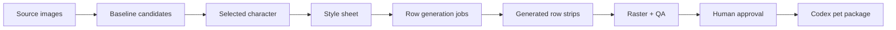

# Goodboy

[](https://github.com/adamallcock/goodboy/actions/workflows/ci.yml)
[](https://github.com/adamallcock/goodboy/releases)
[](https://www.npmjs.com/package/@adamallcock/goodboy)
[](https://pypi.org/project/goodboy-codex/)
[](LICENSE)
[](pyproject.toml)
[](ui/package.json)

Goodboy helps you turn a few reference images into a polished animated Codex pet, with guided generation, visual review, QA checks, and packaging.

It combines a manifest-first CLI, image-generation handoffs, deterministic sprite processing, QA gates, install/export tooling, a Codex skill/plugin wrapper, and a local Review Room UI for visual decisions.

Goodboy is currently an early `0.1.2` developer tool. The CLI pipeline is the reliable workflow, the Review Room is a strong local demo/review surface, and direct provider execution is optional. Expect the image-generation provider names and UI integration surface to continue evolving.

A finished Codex pet package contains a `pet.json` manifest and `spritesheet.webp` atlas that can be installed into Codex or exported for compatible pet viewers.

## Examples

These are small Goodboy-generated state previews from real Codex pet packages:

| Napoleon | Millie | Shoulder Cat |
| --- | --- | --- |
|  |  |  |

## What Goodboy Does

- Source-image ingest with copied references, hashes, thumbnails, EXIF/provenance, and source cards.
- Baseline candidate planning with stored style intent and provider metadata before images are generated.
- Durable character cards, style sheets, feedback branches, and critique records.
- Provider adapters for Codex built-in handoff, OpenAI Images, and Gemini/Nano Banana aliases.
- Row-generation manifests with canonical baseline references, layout guides, chroma-key selection, and agent-safe handoffs.
- Deterministic raster cleanup, frame extraction, centering, atlas composition, previews, and package generation.
- QA reports for clipping, drift, duplicate/static frames, chroma residue, guide copying, transparent RGB residue, and install policy.
- A Codex skill and repo-scoped plugin package that steer agents through safe commands instead of one-off renderer scripts.
- Review Room, a local visual UI for onboarding, demos, state preview, approvals, and details inspection.



## Installation

Clone the repository, create a virtual environment, and install the editable package:

```bash
git clone https://github.com/adamallcock/goodboy.git
cd goodboy

python3 -m venv .venv
source .venv/bin/activate
python -m pip install -U pip
python -m pip install -e ".[ui,dev]"

goodboy --help
```

Or install the Python CLI from PyPI:

```bash
python3 -m pip install goodboy-codex
goodboy --help
```

After installing dependencies, source-checkout development can also use the module entrypoint without installing console scripts:

```bash
PYTHONPATH=src python -m goodboy.cli --help
```

For npm users, [`@adamallcock/goodboy`](https://www.npmjs.com/package/@adamallcock/goodboy) is also available as a small launcher package:

```bash
npx @adamallcock/goodboy --help
```

The npm package delegates to the Python Goodboy CLI. Install Goodboy into your Python environment first:

```bash
python3 -m pip install goodboy-codex
```

## Quick Start

Create a project and stop at the first real image-generation/user gate:

```bash
goodboy start /tmp/goodboy-demo \
  --pet-id demo \
  --display-name Demo \
  --species dog \
  --source /absolute/path/to/source.png

goodboy advance /tmp/goodboy-demo --agent-mode
```

`start` initializes the project, ingests sources, drafts the source card, plans baseline candidates, renders `candidates/contact-sheet.png`, writes `workflow-state.json`, and stops. `advance --agent-mode` runs safe deterministic steps until it reaches provider generation, baseline choice, visual approval, or QA/user override.

When Goodboy stops for image generation, it writes provider prompts and manifests instead of inventing local placeholder art. For Codex built-in generation, ask Codex to generate from the planned prompt and attached references, then pass the generated image path back to `advance`. For API-backed generation, use `execute-openai` or `execute-gemini` when keys are available.

After provider-generated baselines exist, select one:

```bash
goodboy advance /tmp/goodboy-demo \
  --agent-mode \
  --candidate-id baseline-001 \
  --baseline-image /absolute/path/to/generated-baseline.png \
  --run-id planned-row-generation \
  --selection-notes "selected by the user"
```

That selection plans the row-generation run. To inspect the planned row handoffs directly:

```bash
goodboy generate-handoff /tmp/goodboy-demo \
  --run-id planned-row-generation \
  --all
```

Generated row outputs can be imported with a JSON map:

```json
{
  "idle": "/absolute/path/to/idle.png",
  "running-right": "/absolute/path/to/running-right.png",
  "running-left": "/absolute/path/to/running-left.png",
  "waving": "/absolute/path/to/waving.png",
  "jumping": "/absolute/path/to/jumping.png",
  "failed": "/absolute/path/to/failed.png",
  "waiting": "/absolute/path/to/waiting.png",
  "running": "/absolute/path/to/running.png",
  "review": "/absolute/path/to/review.png"
}
```

After provider-generated row strips exist, import them and build the review artifacts:

```bash
goodboy advance /tmp/goodboy-demo \
  --agent-mode \
  --run-id planned-row-generation \
  --generated-map /absolute/path/to/generated-output-map.json \
  --row-provenance provider_generated
```

After visual approval, finish and install:

```bash
goodboy advance /tmp/goodboy-demo \
  --agent-mode \
  --run-id planned-row-generation \
  --row-provenance provider_generated \
  --approval-notes "User approved contact sheet and previews"
```

OpenAI and Gemini API keys are optional accelerators, not setup requirements. Without keys, use the Codex built-in handoff flow. With `OPENAI_API_KEY` or `GEMINI_API_KEY`, direct provider execution can be faster; Goodboy never writes raw API keys to disk.

## Review Room UI

Review Room is the local visual interface under `ui/`. It is designed as a status and decision surface: the user reviews one thing at a time, can inspect final sprite states in a Petdex-style animated viewer, and can open a details drawer only when raw files or QA metadata matter.

Run the read-only UI demo:

```bash
cd ui
npm install
npm run dev
```

Then open:

```text
http://127.0.0.1:5173/
```

Current UI status:

- Bundled generic companion demo that works without private source photos, provider credentials, generated images, or a local Goodboy project.
- Onboarding paths for Codex-led creation and opening a project.
- Simplified decision surface for sources, baselines, style, generation, QA, approval, and export.
- Animated `spritesheet.webp` state viewer for completed pet QA.
- Details drawer for generated files, contact sheets, edge previews, QA reports, provenance, and install policy.
- Playwright coverage for the state viewer, details drawer, keyboard reachability, safe demo refresh, and approval gating.
- FastAPI backend foundation under `src/goodboy/web/`.

Still evolving:

- One-command backend-plus-frontend launch.
- Full live frontend wiring for opening real projects and mutating backend actions. Use the CLI `start` / `advance` workflow as the source of truth today.
- Visual regression screenshots for every primary screen.

## Codex Skill And Plugin

Goodboy includes both a standalone Codex skill and a repo-scoped Codex plugin package:

```text
codex-skill/goodboy/
plugins/goodboy/
.agents/plugins/marketplace.json
```

The skill/plugin is intentionally a wrapper over the CLI. Its most important job is to keep agents on the safe path:

- use `goodboy start` and `goodboy advance --agent-mode`;
- stop at provider and visual approval gates;
- record provenance, feedback, and approvals in manifests;
- never draw placeholder row strips with local renderer scripts unless the user explicitly asks for a test fixture or mock.

To add the repo marketplace from a checkout:

```bash
codex plugin marketplace add /absolute/path/to/goodboy
```

## Development

Run Python tests:

```bash
python -m unittest discover -s tests -v
```

Run skill validation:

```bash
python scripts/validate_skills.py codex-skill/goodboy plugins/goodboy/skills/goodboy
```

Run UI checks:

```bash
cd ui
npm ci
npm run typecheck
npm run build
npm run test:e2e
```

Run whitespace checks:

```bash
git diff --check
```

## Demo Assets

The Review Room demo uses a generic companion fixture under `ui/public/assets/demo/companion/`. These optimized WebP assets are included so the UI can be explored without private source photos, provider credentials, generated images, or a local Goodboy project. See `ui/public/assets/demo/README.md` for asset notes.

Regenerate the public README examples from local pet package spritesheets with:

```bash
python scripts/render_readme_examples.py \
  --napoleon-spritesheet /path/to/napoleon/package/spritesheet.webp \
  --millie-spritesheet /path/to/millie/package/spritesheet.webp \
  --shoulder-cat-spritesheet /path/to/shoulder-kitten/spritesheet.webp
```

## License

Goodboy is released under the MIT License. See `LICENSE`.
