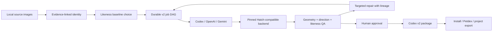

# Goodboy

[](https://github.com/adamallcock/goodboy/actions/workflows/ci.yml)
[](https://github.com/adamallcock/goodboy/releases)
[](https://www.npmjs.com/package/@adamallcock/goodboy)
[](https://pypi.org/project/goodboy-codex/)
[](LICENSE)
[](pyproject.toml)
[](ui/package.json)

Goodboy is a source-faithful studio for creating, reviewing, repairing, and packaging animated Codex pets.

Version `0.2.0` adopts the Codex pet v2 contract: an exact 8 × 11 atlas with nine animation rows, sixteen look directions, `spriteVersionNumber: 2`, and the deterministic visual machinery from a pinned, attributed Hatch Pet backend snapshot.

The distinction is deliberate:

> Hatch Pet is an excellent recipe for hatching a valid Codex pet. Goodboy is the durable workspace for making a pet resemble a specific source subject, proving that resemblance trait by trait, revising only what failed, and resuming the work safely across sessions and providers.

Goodboy does not yet claim that its generated pets are empirically more faithful than Hatch Pet. That claim is withheld until Goodboy passes its frozen, blinded, identity-clustered benchmark protocol. The infrastructure to run that evaluation ships in `0.2.0`.

## Why Goodboy Instead Of Only Hatch Pet?

| Capability | Hatch Pet | Goodboy v2 |
| --- | --- | --- |
| Exact Codex v2 package | Yes | Yes, through a pinned Hatch-compatible backend |
| Fast one-task creation | Excellent | Supported, but intentionally more structured |
| Source-photo likeness | Uses references | Evidence-linked identity profile, locked traits, source/baseline/state comparison sheet, and a blocking human likeness receipt |
| Durable state | Run manifest | Project, versioned identity, job events, provider receipts, approvals, repairs, exports, and migration lineage |
| Recovery | Procedural recovery | Explicit job state machine, interruption recovery, targeted invalidation, archived superseded output |
| Provider choice | Codex image generation | Codex handoff plus optional OpenAI Images and Gemini adapters |
| Privacy controls | Skill workflow | Explicit provider consent, per-source permissions, EXIF-stripped derivatives, source-free exports by default |
| Human review | Generated QA artifacts | Review Room actions for identity, candidates, job DAG, direction, likeness, QA, approval, and export |
| Comparative evidence | Not applicable | Frozen blinded benchmark with minimum-rater, validity, confidence, and release gates |

Use Hatch Pet directly when you want the shortest route to an attractive Codex pet and do not need a durable source-identity project. Use Goodboy when the pet should be recognizably yours, corrections need lineage, privacy choices matter, or the work must survive interruption and provider changes.

## What “Based On A Source Image” Means

Goodboy is not a one-shot “photo in, sprite out” prompt wrapper. Its My Pet workflow is:

1. ingest one or more source images locally;
2. label useful views and details;
3. assess missing coverage and obvious image-quality limitations;
4. draft or import an evidence-linked identity profile;
5. confirm signature traits such as face shape, markings, ear shape, asymmetry, tail, or accessories;
6. create controlled baseline interpretations with one visual treatment, choose
   by likeness, and then select style separately;
7. compile the confirmed identity into every animation and direction prompt;
8. compare sources, the selected baseline, representative animation states, and eight cardinal/intercardinal views;
9. require an evidence note for every locked trait;
10. block approval when a signature trait fails, is uncertain, or is not visible.

Automated color, occupancy, and silhouette-drift signals are warnings only. They never approve source likeness. A human or independent reviewer owns the likeness verdict.

## V2 Architecture



Goodboy owns identity, provider consent and routing, job orchestration, recovery, review, repair lineage, benchmarking, and export. The vendored Apache-2.0 Hatch snapshot owns extraction, cardinal registration, extended-atlas assembly, direction QA, one-pass edge cleanup, and v2 contract validation. Its integrity is pinned in `src/goodboy/vendor/hatch_pet/SNAPSHOT.json`.

## Installation

### Codex Plugin (Recommended)

Install the released Git marketplace, then add Goodboy from that marketplace:

```bash
codex plugin marketplace add adamallcock/goodboy --ref v0.2.1
codex plugin add goodboy@goodboy
```

That is the user-facing starting point. You do **not** need to run
`uv tool install` first. On the first Goodboy task, the plugin checks for the
exact matching Python runtime. If `goodboy-codex[ui]==0.2.1` is absent or a
different version is installed, Codex explains what it found and asks before
installing or replacing anything. After approval, the plugin runs the pinned
uv install, verifies `goodboy 0.2.1`, and continues the original task.

The plugin never treats “make me a pet” or plugin installation as software
installation consent. Its `check` and `run` paths cannot install packages, and
the install path refuses to run without an explicit approval flag. If uv itself
is unavailable, Goodboy stops and asks separately rather than downloading an
installer.

To test an unpublished checkout instead:

```bash
codex plugin marketplace add /absolute/path/to/goodboy
codex plugin add goodboy@goodboy
```

Ask Codex to “use Goodboy to make a Codex pet from these photos.” The skill
handles runtime preflight and then follows the source-identity workflow below.

See [Plugin-First Installation And Publishing](docs/guides/2026-07-17-plugin-first-installation-and-publishing.md)
for the consent state machine, sharing instructions, release order, and
rollback procedure.

### Python CLI

For direct CLI use outside Codex, install the same isolated runtime explicitly:

```bash
uv tool install "goodboy-codex[ui]==0.2.1"
goodboy --version
```

PyPI and virtual-environment installs remain supported:

```bash
python3 -m pip install "goodboy-codex[ui]==0.2.1"
goodboy --help
```

### Contributor Checkout

```bash
git clone https://github.com/adamallcock/goodboy.git
cd goodboy

python3 -m venv .venv
source .venv/bin/activate
python -m pip install -U pip
python -m pip install -e ".[ui,dev]"

goodboy --help
```

The npm package is a standalone launcher for Node users. It discovers an exact
uv-managed runtime but, like the plugin, never installs one silently:

```bash
uv tool install "goodboy-codex[ui]==0.2.1"
npx @adamallcock/goodboy --help
```

## My Pet Quick Start

Start with one or more source images. `start` remains local and stops at identity confirmation; it does not silently send images to a provider.

```bash
goodboy start /tmp/my-goodboy \
  --pet-id millie \
  --display-name Millie \
  --species dog \
  --source /absolute/path/front.jpg \
  --source /absolute/path/side.jpg

goodboy identity-show /tmp/my-goodboy
```

Correct source roles or identity traits if needed, then explicitly confirm identity and provider consent:

```bash
goodboy advance /tmp/my-goodboy \
  --agent-mode \
  --confirm-identity \
  --provider-consent
```

Goodboy creates EXIF-transposed PNG derivatives for the selected provider. Original files remain local and are never provider inputs.

Generate all three planned candidate images through the selected provider,
store each with `candidate-image`, score each one, and only then choose the one
that best resembles the source.
Likeness candidates keep lighting, framing, material, and stylization fixed
while emphasizing different confirmed identity evidence; style is configured
after the likeness choice. Goodboy creates a normalized review tile for each
candidate so provider framing cannot win the comparison:

```bash
goodboy candidate-image /tmp/my-goodboy \
  --candidate-id baseline-001 \
  --image-path /absolute/path/generated-baseline.png

goodboy candidate-review /tmp/my-goodboy \
  --candidate-id baseline-001 \
  --holistic-gestalt-score 4.5 \
  --signature-trait-score 4.0 \
  --small-size-readability-score 4.0 \
  --notes "Head mass, muzzle, body proportions, coat volume, and markings match" \
  --reviewed-by human

goodboy select-candidate /tmp/my-goodboy \
  --candidate-id baseline-001 \
  --notes "Best face shape, ears, and side marking"

goodboy advance /tmp/my-goodboy \
  --agent-mode \
  --run-id millie-v2
```

The v2 run contains twelve post-baseline jobs:

- nine animation rows;
- one four-cardinal anchor strip;
- look row 9;
- look row 10.

Only dependency-ready jobs are handed off. `running-left` follows `running-right`; cardinals wait for all standard rows; row 9 waits for cardinals; row 10 waits for cardinals and row 9.

```bash
goodboy generate-handoff /tmp/my-goodboy \
  --run-id millie-v2 \
  --all
```

The returned `expected_outputs[].input_images` and matching
`input_image_roles` are already packed to the selected provider's hard
reference limit, with canonical identity, dependency evidence, and the layout
guide prioritized. Each look row receives a three-anchor reference containing
only its intended half-turn.

Import one wave at a time, or provide all completed outputs in one map and let the importer resolve dependency order:

```json
{
  "idle": "/absolute/path/idle.png",
  "running-right": "/absolute/path/running-right.png",
  "running-left": "/absolute/path/running-left.png",
  "waving": "/absolute/path/waving.png",
  "jumping": "/absolute/path/jumping.png",
  "failed": "/absolute/path/failed.png",
  "waiting": "/absolute/path/waiting.png",
  "running": "/absolute/path/running.png",
  "review": "/absolute/path/review.png",
  "look-cardinals": "/absolute/path/look-cardinals.png",
  "look-row-9": "/absolute/path/look-row-9.png",
  "look-row-10": "/absolute/path/look-row-10.png"
}
```

```bash
goodboy import-generated /tmp/my-goodboy \
  --run-id millie-v2 \
  --map /absolute/path/generated-output-map.json

goodboy build-review /tmp/my-goodboy \
  --run-id millie-v2 \
  --row-provenance provider_generated
```

Complete the nine-state animation, direction, blind-direction, and trait-level
likeness reviews. The animation verdict file must contain one entry per state
with `verdict`, `state_semantics`, `motion_continuity`, and
`identity_consistency` evidence. `review-status --agent-mode` names every
missing gate and artifact:

```bash
goodboy review-status /tmp/my-goodboy \
  --run-id millie-v2 \
  --agent-mode

goodboy animation-review /tmp/my-goodboy \
  --run-id millie-v2 \
  --verdicts /absolute/path/animation-verdicts.json \
  --reviewer human
```

After those reviews pass, record final visual approval and install:

```bash
goodboy finish /tmp/my-goodboy \
  --run-id millie-v2 \
  --row-provenance provider_generated \
  --approval-notes "Approved identity, motion, directions, edges, and source likeness"
```

The completed run contains both `qa/likeness-receipt.json` and a readable
`qa/likeness-receipt.md`. They include the confirmed trait evidence, baseline
decision, identity pack, provider snapshots, repairs, run lineage, and final
visual approval.

At any point, these commands are safe orientation tools:

```bash
goodboy next /tmp/my-goodboy --agent-mode
goodboy doctor /tmp/my-goodboy --agent-mode
goodboy job-graph /tmp/my-goodboy --run-id millie-v2
goodboy validate /tmp/my-goodboy
```

The complete walkthrough and review JSON formats are in [V2 My Pet Workflow](docs/guides/2026-07-16-v2-my-pet-workflow.md).

## Recovery And Targeted Repair

Goodboy records every job transition in `runs/<run-id>/events.jsonl`.

If a process stops while deterministic processing is running, `recover` resets only that safe work. If a provider call was in flight, Goodboy blocks it as “outcome unknown” instead of creating a duplicate paid request:

```bash
goodboy recover /tmp/my-goodboy --run-id millie-v2
```

Repair archives the selected output and invalidates its dependency closure:

```bash
goodboy repair /tmp/my-goodboy \
  --run-id millie-v2 \
  --job-id row-idle \
  --reason "Face marking drifts in frames 3-5"
```

Changing a locked identity trait versions the identity profile and invalidates every output that depended on the old identity:

```bash
goodboy identity-patch /tmp/my-goodboy \
  --trait-id markings.primary \
  --value "White blaze bends toward the pet's anatomical left eye" \
  --reason "The earlier description reversed the side" \
  --run-id millie-v2
```

## Upgrade A V1 Pet

Goodboy can preserve an existing approved 8 × 9 atlas and generate only the missing v2 direction rows:

```bash
goodboy upgrade /path/to/legacy-project \
  --run-id legacy-to-v2 \
  --provider codex_builtin \
  --model-alias codex-imagegen
```

The upgrade:

- archives the original manifest and standard atlas;
- changes the project contract only after writing a migration receipt;
- creates only `look-cardinals`, `look-row-9`, and `look-row-10`;
- preserves rows 0–8 as the standard intermediate;
- records before/after hashes;
- never mutates the original v1 artifacts in place.

See [V1 To V2 Migration](docs/guides/2026-07-16-v1-to-v2-migration.md).

## Review Room

Review Room is a local frontend backed by the Goodboy FastAPI action layer:

```bash
goodboy ui /tmp/my-goodboy --host 127.0.0.1 --port 8787
```

The compiled Review Room ships inside the Python wheel; Node is not required at
runtime. When a project path is supplied, the loopback-only server opens that
project directly. Goodboy refuses non-loopback binds because the API can read
and mutate explicitly selected local project files.

It can:

- create or open a real project;
- upload or register source images;
- assign source roles and provider permissions;
- confirm and patch identity traits;
- plan, normalize, score, and select identity-preserving candidates;
- configure style;
- show the real dependency graph and event history;
- import generated outputs;
- record animation-correctness, direction, and likeness verdicts;
- trigger targeted repair;
- approve, finish, and export.

The CLI remains the canonical automation surface; the UI calls the same backend actions and manifests.

## Privacy And Exports

Goodboy’s defaults are designed for private source material:

- original images are copied into `sources/originals/` and stay local;
- provider work requires explicit consent;
- only current, consented, hash-checked, EXIF-stripped PNG derivatives are provider inputs;
- consent is provider-specific and recorded;
- project exports exclude source pixels and source-bearing comparison sheets by default;
- Petdex exports contain only the v2 package and export metadata;
- diagnostic exports omit images, prompts, raw provider responses, request IDs, input hashes, and credential-like values;
- persisted deterministic receipts use portable paths rather than machine-local paths.

To deliberately include sources in a project archive:

```bash
goodboy export project /tmp/my-goodboy \
  --run-id millie-v2 \
  --include-sources
```

Safe exports:

```bash
goodboy export petdex /tmp/my-goodboy --run-id millie-v2
goodboy export diagnostic /tmp/my-goodboy --run-id millie-v2
```

See [Privacy And Data Handling](docs/reference/2026-07-16-privacy-and-data-handling.md).

## Benchmarking “Better Than Hatch”

Comparative claims are governed by a predeclared protocol:

```bash
goodboy benchmark init /tmp/goodboy-benchmark \
  --benchmark-id goodboy-v2 \
  --seed frozen-public-seed \
  --release-min-identities 30 \
  --min-raters 3

goodboy benchmark prepare /tmp/goodboy-benchmark \
  --comparisons /absolute/path/comparisons.json

goodboy benchmark rate /tmp/goodboy-benchmark \
  --ratings /absolute/path/reviewer-01.json

goodboy benchmark analyze /tmp/goodboy-benchmark
```

The analyzer randomizes A/B positions, keeps the answer key private, validates
and hashes each method's real v2 package, aggregates at the identity rather
than frame level, reports Wilson and identity-cluster bootstrap intervals, and
withholds the “better likeness” claim unless all predeclared release gates
pass. The frozen policy hash, independently verified v2 validity, visual
appeal, animation clarity, and unacceptable-failure gates can veto a likeness
win. Self-reported validity booleans never authorize the claim.

See [Benchmark Protocol](docs/reference/2026-07-16-goodboy-vs-hatch-benchmark.md).

## Provider Adapters

`codex_builtin` is the default interactive handoff. `openai_images`, `gemini_nano_banana_2`, and `gemini_nano_banana_pro` are optional accelerators.

```bash
goodboy adapters --json
goodboy execute-openai /tmp/my-goodboy --run-id millie-v2 --job-id row-idle --dry-run
goodboy execute-gemini /tmp/my-goodboy --run-id millie-v2 --job-id row-idle --dry-run
```

Direct API execution reads `OPENAI_API_KEY` or `GEMINI_API_KEY` from the environment and never persists raw keys. Provider aliases and exact invocation snapshots are recorded so a later repair can explain what changed.

## Development And Verification

Python:

```bash
python -m unittest discover -s tests -v
python scripts/validate_skills.py \
  codex-skill/goodboy \
  plugins/goodboy/skills/goodboy
python -m compileall -q src tests
```

Review Room:

```bash
cd ui
npm ci
npm run typecheck
npm run build:package
npm run check:package
npm run test:e2e
```

Release packages:

```bash
python -m build
python -m zipfile -l dist/goodboy_codex-0.2.1-py3-none-any.whl
```

The implementation plan and current scope are recorded in [Goodboy V2
Next-Level Plan](2026-07-16-goodboy-v2-next-level-plan.md). Its
section-by-section completion boundary is [Goodboy V2 Implementation
Audit](docs/reference/2026-07-16-v2-implementation-audit.md). The original
evidence-backed comparison is [Goodboy vs Hatch Pet Capability
Validation](2026-07-16-goodboy-vs-hatch-pet-validation.md).

## Examples

These legacy examples were produced by the earlier Goodboy pipeline and remain useful visual references. They are not evidence for v2 parity or source-likeness superiority:

| Napoleon | Millie | Shoulder Cat |
| --- | --- | --- |
|  |  |  |

## License

Goodboy’s original code is MIT licensed. The pinned Hatch Pet backend under `src/goodboy/vendor/hatch_pet/` is redistributed under Apache License 2.0. See [THIRD_PARTY_NOTICES.md](THIRD_PARTY_NOTICES.md) and the vendored `LICENSE.txt`.
