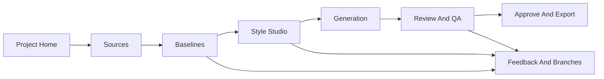

# Goodboy Local Web UI Requirements

## 1. Executive Summary

Goodboy M10 should become a local, high-quality creative production console for turning source images into Codex pet packages. The UI should make the visual workflow feel calm, legible, and impressive enough to show hiring managers, while preserving the manifest-first safety rails that make Goodboy repeatable.

The UI is not a replacement for the CLI, Codex skill, plugin package, or provider adapters. It is a visual layer over the same project directory and manifests. It should make the hard parts easier: comparing sources, choosing baseline style, reviewing row strips, seeing animation drift, reading QA failures, recording critique, forking feedback, approving the final package, and exporting/installing with confidence.

The product should feel like a focused local studio tool: refined, visual, operational, and trustworthy. It should not feel like a marketing landing page, a toy prototype, or a decorative dashboard.

## 2. Current System Context

Goodboy already has:

- A Python package and CLI.
- Manifest validation.
- Source ingestion, thumbnails, EXIF/provenance reporting, and source cards.
- Baseline candidate planning, prompts, contact sheets, generated candidate image storage, and baseline selection.
- Character cards and customizable style sheets.
- Style presets including realistic, anime, storybook, pixel, sticker, soft-lifelike, and subject kinds for pets, animals, objects, inanimate objects, people, and fantasy creatures.
- Human/AI feedback events, critique reports, and branch manifests.
- Provider adapters for Codex built-in handoff, OpenAI Images, Gemini Nano Banana 2, and Gemini Nano Banana Pro.
- Row planning, provider handoffs, import maps, build-review, finish, and export commands.
- Raster processing, chroma cleanup, state-aware centering, centering overlays, duplicate/static audits, QA reports, contact sheets, GIF previews, package generation, and install policy gates.
- Agent Rail commands (`start`, `advance`, `doctor`) that reduce command count for Codex agents.
- A Codex skill and repo-scoped Codex plugin wrapper.

M10 should expose these capabilities visually without creating a second state model.

## 3. Primary Goals

1. Make the visual decision process significantly easier than inspecting files manually.
2. Make Goodboy demoable as a polished, modern local product.
3. Preserve every provenance, QA, approval, and safety gate from the CLI.
4. Make style customization first-class, including realism, anime, sticker, pixel, storybook, soft-lifelike, human critique, AI critique, and non-animal/inanimate mascots.
5. Reduce agent/user confusion by turning workflow gates into obvious screens and actions.
6. Provide enough progress, artifact, and audit visibility that a user understands what happened and why.
7. Keep the app local-first, private by default, and provider-neutral.

## 4. Non-Goals

- Do not build a public hosted SaaS product in M10.
- Do not replace the Python CLI or library.
- Do not bypass visual approval, row provenance, install policy, or QA gates.
- Do not hide generated prompts, provider metadata, or critique history.
- Do not store raw API keys in project manifests, logs, docs, or browser storage.
- Do not create a chat-only workflow where decisions disappear from disk.
- Do not use a plugin UI as the primary image-heavy review surface unless Codex plugin capabilities later become rich enough.
- Do not implement a generic pet social/gallery product before the local production workflow is excellent.

## 5. Product Ethos

Goodboy should feel like a careful studio assistant, not a button-mashing generator.

The interface should communicate:

- Craft: source references, prompts, generated images, row strips, QA overlays, and exports are handled as real creative assets.
- Trust: every visible decision has a provenance trail and a reversible path.
- Calm control: the user knows the next safe action and why other actions are blocked.
- Visual taste: the app looks modern and sophisticated, but the design serves review accuracy.
- Local privacy: source photos and generated pet assets stay in a local project unless the user chooses a provider call or export.
- Agent compatibility: Codex agents can drive the same workflow through the CLI, and the UI can explain the current gate in human terms.

## 6. Users And Audiences

### 6.1 Primary Creator

The creator supplies source images, chooses a baseline direction, gives style feedback, reviews QA, and approves install/export. This user wants a polished result and needs to trust the tool.

### 6.2 Codex Agent Operator

The operator may ask Codex to create or continue a pet. They need the UI to make gates visible, reduce accidental command sprawl, and prevent agents from inventing renderer scripts or installing unapproved work.

### 6.3 Reviewer Or Hiring Manager

The reviewer is seeing Goodboy as a portfolio-quality system. They need to understand the product story quickly: input images become a polished animated Codex pet through a systematic, auditable AI-assisted workflow.

### 6.4 Developer Maintainer

The maintainer needs clear module boundaries, testability, reproducible fixtures, and a UI architecture that does not tangle with the deterministic pipeline.

## 7. Success Criteria

The M10 UI is successful when:

- A user can open an existing Goodboy project and understand its stage in under 10 seconds.
- A user can compare candidate baselines, inspect style intent, and record a baseline choice without opening JSON files.
- A user can inspect row strips, GIF previews, centering overlays, edge previews, and QA metrics in one review board.
- A user can see why install/export is allowed or blocked.
- A user can record feedback and create a fork/branch from the UI.
- A user can choose or edit style direction with durable artifacts, not only prompt text.
- A hiring manager can watch a short walkthrough and understand the system quality, not just the final pet image.
- The CLI remains the source of truth, and all UI actions update the same manifests that existing tests validate.

## 8. Recommended Product Shape

The recommended shape is a local web app:

- Frontend: React + Vite + TypeScript.
- Backend: Python local server that imports Goodboy modules and exposes a narrow HTTP/SSE API.
- Data source: the existing project directory and JSON manifests.
- File access: local-only artifact browser with explicit project root selection.
- Execution: backend invokes Goodboy library functions or CLI-compatible workflow functions, then streams progress and refreshed artifact state.

This gives Goodboy a polished product surface while keeping the deterministic Python pipeline intact.

## 9. Architecture Requirements

### 9.1 Local Server

- The UI must run locally.
- The server must default to loopback only.
- The server must never expose project files on a public interface by default.
- The server should accept an explicit project directory and maintain a recent-projects list.
- The server should serve static artifact previews from approved project paths only.
- The server should expose project state through structured JSON endpoints.
- Long-running operations should stream status through Server-Sent Events or WebSocket.

### 9.2 Frontend App

- The app should be desktop-first and responsive down to a practical tablet/mobile review mode.
- The frontend should use a componentized design system rather than one large app component.
- The app should provide a stable shell with navigation, project status, command access, and artifact context.
- The frontend should never mutate project files directly. All writes go through backend actions.
- The frontend should display stale/refreshing states when disk artifacts change.

### 9.3 Backend Integration

- Backend actions should map cleanly to existing Goodboy workflow concepts.
- Prefer importing Goodboy modules for deterministic operations.
- Shelling out to the CLI is acceptable for parity or transitional implementation, but command execution must be wrapped, logged, cancellable where possible, and path-safe.
- Every backend write should run manifest validation or return a validation status.
- Backend responses should include the current workflow gate, next recommended action, and any blocking reason.

### 9.4 Artifact Index

- The server should build a project artifact index from manifests and known paths.
- The index should classify artifacts as source, candidate, character, style, row strip, QA, preview, final, package, export, feedback, critique, or log.
- The index should include existence, modified time, size, dimensions for images, and validation status where practical.
- Artifact URLs should be stable for the UI and safe against path traversal.
- The app should update automatically when known artifacts change on disk.

## 10. Information Architecture

The app should have one project shell and seven primary work areas.

### 10.1 Project Home

Purpose: show current stage, gate, best next action, project health, and key artifacts.

### 10.2 Sources

Purpose: compare source images, thumbnails, EXIF/provenance, source-card traits, and source risks.

### 10.3 Baselines

Purpose: browse generated baseline candidates, compare style intent, inspect prompts, and select a canonical baseline.

### 10.4 Style Studio

Purpose: define durable style direction, subject kind, critique, and customization before row generation.

### 10.5 Generation

Purpose: plan jobs, inspect prompts, use provider handoff/API accelerators, import generated outputs, and track retries/failures.

### 10.6 Review And QA

Purpose: inspect contact sheets, GIF previews, row strips, centering overlays, edge previews, QA metrics, duplicate/static audits, and install policy.

### 10.7 Approve And Export

Purpose: record visual approval, finish/install when policy allows, and export project/Petdex-ready packages.

### 10.8 Feedback And Branches

Purpose: record human or AI feedback, create branch manifests, inspect critique history, and fork targeted iterations.

## 11. Core Functional Requirements

### 11.1 Project Management

- FR-PROJ-001: Open an existing Goodboy project directory.
- FR-PROJ-002: Create a new project by collecting pet ID, display name, species/subject kind, notes, provider preference, and source images.
- FR-PROJ-003: Show current workflow gate from `workflow-state.json` and `goodboy advance --agent-mode` compatible state.
- FR-PROJ-004: Show project health: validation status, missing artifacts, stale artifacts, install readiness, and suspicious renderer script scan result.
- FR-PROJ-005: Provide a read-only "show project folder" action for quick access.
- FR-PROJ-006: Provide a recent projects list stored outside the project and safe to clear.

### 11.2 Source Intake And Comparison

- FR-SRC-001: Drag and drop source images into a new or existing project.
- FR-SRC-002: Show original images, thumbnails, dimensions, file type, hash, and provenance metadata.
- FR-SRC-003: Show duplicate detection results.
- FR-SRC-004: Allow editing source-card fields through structured controls.
- FR-SRC-005: Highlight stable traits, do-not-change traits, uncertain traits, and excluded background/person/environment details.
- FR-SRC-006: Support subject kinds beyond pets, including inanimate objects and fantasy mascots.
- FR-SRC-007: Provide a side-by-side source comparison view with zoom and pan.

### 11.3 Baseline Candidate Browser

- FR-BASE-001: Render candidate gallery from `candidates/baseline-candidates.json`.
- FR-BASE-002: Show generated image status for each candidate.
- FR-BASE-003: Show style summary, character delta, provider, model alias, prompt path, strengths, and risks for each candidate.
- FR-BASE-004: Show `candidates/contact-sheet.png` when available.
- FR-BASE-005: Provide a focused compare mode for two to six candidates.
- FR-BASE-006: Allow baseline selection only when an image path exists.
- FR-BASE-007: Record selection notes and selected timestamp.
- FR-BASE-008: Copy selected baseline into canonical character artifacts through backend action.
- FR-BASE-009: Provide regenerate/fork intent controls without overwriting existing candidate records silently.

### 11.4 Style Studio

- FR-STYLE-001: Show the selected baseline image beside style controls.
- FR-STYLE-002: Support style presets: soft-lifelike, realistic, anime, storybook, pixel, sticker, and custom.
- FR-STYLE-003: Support subject kinds: pet, animal, person, object, inanimate_object, fantasy_creature, and custom.
- FR-STYLE-004: Show global avoid terms, prop policy, effects policy, background policy, centering policy, and QA thresholds.
- FR-STYLE-005: Allow user style notes to be recorded in durable style artifacts.
- FR-STYLE-006: Allow human critique entries and optional apply-to-style behavior.
- FR-STYLE-007: Allow AI critique entries from supported visual-critic adapters when configured.
- FR-STYLE-008: Show a diff between current style sheet and proposed critique/style changes before applying.
- FR-STYLE-009: Preserve old style sheets when creating a new forked style direction.
- FR-STYLE-010: Make style customization understandable to non-technical users while still exposing prompts and manifests for agents.

### 11.5 Generation Control

- FR-GEN-001: Plan row jobs for a selected baseline and style sheet.
- FR-GEN-002: Show each job by state, frame count, provider, model alias, prompt, input image, expected output, retry policy, and status.
- FR-GEN-003: Generate provider handoff files for Codex built-in generation.
- FR-GEN-004: Show optional API accelerator availability without treating missing keys as an error.
- FR-GEN-005: Execute OpenAI/Gemini jobs only when the required key is available and the user explicitly starts the operation.
- FR-GEN-006: Import generated output maps through a structured UI rather than manual copy commands.
- FR-GEN-007: Validate imported row strip dimensions and file existence before build-review.
- FR-GEN-008: Display provider failure/retry metadata and recommended next action.
- FR-GEN-009: Prevent ad hoc renderer script creation or programmatic mascot drawing as a normal workflow path.

### 11.6 Review And QA

- FR-QA-001: Show final contact sheet at a useful size with zoom.
- FR-QA-002: Show per-state GIF previews with playback, pause, restart, and speed controls.
- FR-QA-003: Show raw row strips and extracted frame grids.
- FR-QA-004: Show edge preview on white and transparent/checkerboard backgrounds.
- FR-QA-005: Show centering overlay and centering report.
- FR-QA-006: Highlight states with clipping, drift, static/duplicate frames, green-edge residue, transparent RGB residue, dimension problems, or component-count warnings.
- FR-QA-007: Provide per-state metrics: frame count, max drift, edge clearance, duplicate suspicion, component counts, and install-blocking severity.
- FR-QA-008: Provide a human review checklist.
- FR-QA-009: Let users record approval notes only after required review artifacts exist.
- FR-QA-010: Show install policy exactly: hard failures, warnings, override status, row provenance, and visual approval status.

### 11.7 Feedback And Forks

- FR-FB-001: Record feedback events targeted at source, baseline, style, row, QA, or package.
- FR-FB-002: Create branch manifests for meaningful changes such as happier, trim-green, center-idle, anime-style, or object-mascot.
- FR-FB-003: Show branch lineage and active branch.
- FR-FB-004: Let a user fork from selected baseline, style sheet, row generation run, or QA failure.
- FR-FB-005: Separate human critique, AI critique, and provider observations in the history.
- FR-FB-006: Preserve rejected candidates and failed runs as useful evidence.

### 11.8 Approval, Install, And Export

- FR-OUT-001: Show package artifacts: `pet.json`, `spritesheet.webp`, run summary, and exports.
- FR-OUT-002: Finish or install only when install policy allows or an explicit override reason is recorded.
- FR-OUT-003: Show exactly what install will replace before writing to the Codex pet directory.
- FR-OUT-004: Export project archives and Petdex-ready packages.
- FR-OUT-005: Include a shareable demo summary with source thumbnails, selected baseline, review sheet, QA status, and final animation previews.

### 11.9 Demo Mode

- FR-DEMO-001: Provide a polished read-only demo path using a bundled or generated fixture project.
- FR-DEMO-002: Show the "before to after" story: sources, baseline options, chosen character, style sheet, rows, QA, and final package.
- FR-DEMO-003: Hide private filesystem paths by default in demo mode.
- FR-DEMO-004: Include a presentation-friendly activity timeline.
- FR-DEMO-005: Use real Goodboy artifacts, not mocked screenshots, for the demo.

## 12. Visual And Interaction Requirements

### 12.1 Overall Feel

The UI should feel like a modern creative operations tool: precise, visual, confident, and calm. It should have the polish of a high-end local developer tool and the clarity of a production review console.

It should avoid:

- Decorative landing-page hero sections.
- Generic card grids where tables, rails, or split panes are more useful.
- Nested cards.
- One-note purple, dark-blue/slate, beige, brown/orange, or gradient-heavy palettes.
- Decorative blobs, orbs, bokeh, or stock-like atmosphere.
- Oversized marketing typography inside operational screens.
- Fake metrics that do not map to real Goodboy artifacts.

### 12.2 Layout Model

- Desktop shell with left project navigation, central visual workspace, right inspector, and lower activity/log drawer.
- The central workspace should be artifact-first: images, GIFs, overlays, rows, and contact sheets dominate when review is the task.
- The inspector should show structured metadata, gates, warnings, and actions for the selected artifact.
- The activity/log drawer should show recent Goodboy actions, validation events, provider calls, and file updates.
- Mobile should prioritize read-only review, approval status, and simple feedback entry rather than full generation control.

### 12.3 Component Families

Required component families:

- Project switcher.
- Stage navigation.
- Gate banner.
- Artifact grid.
- Image viewer with zoom/pan.
- Candidate compare tray.
- Style preset segmented control.
- Subject-kind selector.
- Prompt/manifest viewer.
- Critique composer.
- Job table.
- Provider status cards.
- Import-map builder.
- GIF preview player.
- Contact sheet inspector.
- QA metric table.
- Install policy panel.
- Human review checklist.
- Feedback timeline.
- Branch graph/list.
- Approval modal.
- Export panel.
- Command palette.
- Toast/status notifications.

### 12.4 Visual Detail

- Use stable dimensions for thumbnails, GIF previews, contact sheets, toolbars, and metric rows.
- Use icons for tool actions where familiar symbols exist.
- Use labels where precision matters, especially for gates and QA severity.
- Use color sparingly and semantically: pass, warning, fail, selected, provider, branch.
- Avoid green accents that could visually conflict with chroma-key/green-edge QA.
- Show real images and previews whenever available.
- For missing artifacts, show precise empty states with next action, not decorative placeholders.
- Keep typography tight and professional in dense panels.
- Preserve text legibility across all expected viewport sizes.

## 13. Accessibility Requirements

- Keyboard navigation for all core workflows.
- Visible focus states.
- Color contrast meeting WCAG AA for text and controls.
- Do not rely on color alone for QA severity.
- Alt text or accessible labels for source images, candidate images, and previews.
- Reduced-motion mode that pauses autoplaying previews and disables nonessential motion.
- Screen-reader friendly status updates for command progress and validation results.

## 14. Security And Privacy Requirements

- Bind local server to loopback by default.
- Validate project roots before serving artifacts.
- Prevent path traversal in all artifact routes.
- Never expose arbitrary local files through the UI.
- Never write raw API keys to disk or browser storage.
- Redact secrets from logs and command output.
- Display provider calls as explicit user-started operations.
- Make external model/vision critique opt-in and clearly disclose which source images or generated artifacts will be sent.
- Preserve local-only operation when provider keys are missing.

## 15. Performance Requirements

- Project home should become usable within 1 second for normal project sizes after server start.
- Source and candidate thumbnails should lazy-load.
- Large contact sheets should use progressive rendering or browser-native image scaling.
- GIF preview playback should not block the rest of the UI.
- Artifact indexing should be incremental after the initial scan.
- Command streaming should start within 250 ms of command launch.
- UI state should remain responsive during long provider or raster operations.

## 16. Reliability Requirements

- Every mutating action should be idempotent or clearly guarded against duplicate execution.
- The app should survive refresh without losing project context.
- If a command fails, show the command category, failure summary, affected artifact, and safe next action.
- If disk state changes externally, the UI should refresh or show a stale-state warning.
- If a workflow gate blocks progress, show the exact missing input or approval.
- If QA warns but install remains possible, distinguish warnings from hard failures.
- If QA blocks install, the install action should be disabled until override or repair.

## 17. Testing Requirements

### 17.1 Backend Tests

- API contract tests for project load, artifact index, source ingest, candidate selection, style update, critique write, job planning, import-generated, build-review, approval, finish, and export.
- Path safety tests for artifact routes.
- Secret redaction tests for logs and provider metadata.
- Fixture tests using synthetic row strips.

### 17.2 Frontend Tests

- Component tests for core controls and artifact states.
- Playwright tests for the main workflow using a fixture project.
- Accessibility checks for keyboard flow, labels, and contrast.
- Visual regression snapshots for project home, candidate browser, style studio, review board, approval panel, and demo mode.

### 17.3 End-To-End Tests

- Create project from fixture sources.
- Select a fixture baseline.
- Apply a style preset and critique.
- Import fixture row outputs.
- Build review.
- Inspect QA.
- Approve.
- Export.
- Verify no install occurs without explicit approval.

## 18. API Surface Requirements

Initial backend routes should include:

- `GET /api/health`
- `GET /api/projects/recent`
- `POST /api/projects/open`
- `POST /api/projects/create`
- `GET /api/projects/{project_id}/state`
- `GET /api/projects/{project_id}/artifacts`
- `GET /api/projects/{project_id}/artifact/{artifact_id}`
- `POST /api/projects/{project_id}/sources/ingest`
- `POST /api/projects/{project_id}/source-card`
- `POST /api/projects/{project_id}/candidates/plan`
- `POST /api/projects/{project_id}/candidates/{candidate_id}/image`
- `POST /api/projects/{project_id}/candidates/{candidate_id}/select`
- `POST /api/projects/{project_id}/style/default`
- `POST /api/projects/{project_id}/critique`
- `POST /api/projects/{project_id}/rows/plan`
- `POST /api/projects/{project_id}/generation/handoff`
- `POST /api/projects/{project_id}/generation/import`
- `POST /api/projects/{project_id}/review/build`
- `POST /api/projects/{project_id}/approval`
- `POST /api/projects/{project_id}/finish`
- `POST /api/projects/{project_id}/export`
- `GET /api/projects/{project_id}/events`

Route names can change during implementation, but the capability boundaries should remain.

## 19. Data Model Requirements

The UI should normalize existing manifests into view models.

Required view models:

- `ProjectSummary`
- `WorkflowGate`
- `ArtifactRef`
- `SourceImageView`
- `SourceCardView`
- `CandidateView`
- `CharacterView`
- `StyleSheetView`
- `CritiqueView`
- `FeedbackEventView`
- `BranchView`
- `GenerationJobView`
- `ProviderInvocationView`
- `RunSummaryView`
- `QAReportView`
- `InstallPolicyView`
- `ExportView`

View models should include raw manifest paths for transparency and debugging, but UI components should use typed fields instead of parsing arbitrary JSON themselves.

## 20. Implementation Milestones For M10

### UI0: Product Spec And Design Direction

- Requirements spec.
- Information architecture.
- Design option brief.
- Clickable or visual concept options.
- Final accepted design direction.

### UI1: Local Server And Read-Only Project Browser

- Local server.
- Artifact index.
- Project open.
- Project home.
- Source viewer.
- Candidate gallery read-only.
- QA artifact read-only viewer.

### UI2: Source, Baseline, And Style Actions

- Source ingest.
- Source card editor.
- Candidate planning and contact sheet.
- Candidate image registration.
- Baseline selection.
- Style Studio.
- Critique and feedback recording.

### UI3: Generation And Import Workflow

- Row planning.
- Handoff generation.
- Optional API accelerator status.
- Generated-output map builder.
- Import-generated.
- Provider failure/retry display.

### UI4: Review, Approval, Finish, And Export

- Review board.
- GIF preview player.
- QA metrics and policy panel.
- Human review checklist.
- Approval flow.
- Finish/install/export.

### UI5: Demo Polish And Hiring-Manager Mode

- Fixture/demo project.
- Presentation timeline.
- Before/after narrative.
- Responsive polish.
- Visual regression baseline.
- README/user guide update.

## 21. Design Option Criteria

When producing visual design options, evaluate each option against:

- Does it make visual review easier than file inspection?
- Does it look like a serious modern product, not a prototype?
- Does it foreground real artifacts rather than decorative UI?
- Does it make the workflow gate obvious?
- Does it preserve Goodboy's manifest-first story?
- Does it support style exploration without becoming prompt soup?
- Does it communicate QA rigor to a hiring manager?
- Does it scale from animal pets to inanimate object mascots?
- Does it avoid hiding important warnings behind aesthetic polish?

## 22. Candidate Design Directions To Explore

### Option A: Studio Console

A professional desktop tool with a stable left navigation rail, large central artifact canvas, right inspector, and bottom activity drawer. This is the recommended default because it matches Goodboy's work pattern: compare visual artifacts, inspect metadata, act on the current gate.

Best for:

- Candidate review.
- QA inspection.
- Hiring-manager walkthroughs.
- Future extensibility.

Risk:

- Needs careful visual design to avoid feeling like a generic admin dashboard.

### Option B: Storyboard Pipeline

A horizontal workflow where each stage is a visual board: Sources, Baselines, Style, Rows, QA, Export. Each board shows the artifacts created at that stage and the transition to the next stage.

Best for:

- Explaining the product story.
- Demo mode.
- Users who are new to the workflow.

Risk:

- Could become less efficient for detailed QA unless paired with strong inspector and zoom tools.

### Option C: Review Room

An image-first interface where the current artifact fills most of the screen, with lightweight stage controls and an inspector that opens only when needed. This treats Goodboy as a visual review application first.

Best for:

- Baseline selection.
- Contact sheet/GIF QA.
- Polished visual impression.

Risk:

- Generation details, provider metadata, and safety gates may feel secondary unless deliberately designed.

### Option D: Command Center

A developer-product interface centered around gates, commands, logs, artifacts, and policy. It would feel closest to Codex and the CLI while adding a visual layer.

Best for:

- Agent operators.
- Debugging.
- Trust and auditability.

Risk:

- May underserve the "excellent showpiece UI" goal unless softened with rich visual artifact presentation.

## 23. Recommended Direction

Start from Option C: Review Room.

Review Room should be the default product surface because Goodboy's highest-value user decisions are visual: compare the source, judge the baseline, inspect the animation, catch drift or residue, approve or request changes, then export/install. A simpler artifact-first interface is more compelling for users and stronger for hiring-manager demos than a permanently dense operations console.

Borrow from the other options deliberately:

- Use Option A's Studio Console structure only as an advanced/debug posture through collapsible command, log, job, and manifest panels.
- Use Option B's narrative timeline for demo mode and project-stage orientation.
- Use Option D's command/log rigor for agent trust, provenance, and workflow gates.

This direction keeps the primary experience visual and simple while preserving Goodboy's operational credibility underneath.

## 24. Acceptance Criteria For M10

M10 should not be marked complete until:

- The UI can open and render a real Goodboy project.
- The UI can show source images, candidate baselines, selected baseline, style sheet, row jobs, review artifacts, QA reports, approval state, package files, and exports.
- The UI can perform at least the main mutating actions through the backend: source ingest, source-card update, candidate plan/image/select, style update, critique/feedback, row plan, handoff/import, review build, approval, finish/export.
- The UI preserves all install policy gates.
- The UI has visual QA for contact sheet, GIF previews, edge preview, and centering overlay.
- The UI has a demo mode or fixture project suitable for a hiring-manager walkthrough.
- The UI has Playwright coverage for the happy path and major gates.
- The UI has at least one visual regression snapshot for each primary screen.
- The user guide explains how to install, launch, and use the UI.
- The milestone tracker links to the implementation and verification evidence.

## 25. Open Decisions

1. Should the frontend use Tailwind-only custom components or generated shadcn component files for the first slice?
2. Should install remain an explicit CLI-backed backend action, or should the UI call lower-level package functions directly?
3. How much of the first build should be read-only review before enabling mutating actions?
4. Should demo mode use only synthetic fixture artifacts, or also include a bundled anonymized real pet project?

## 26. Current Implementation Slice

The first Review Room implementation slice exists under `ui/`, backed by the FastAPI project API foundation in `src/goodboy/web/`.

Implemented:

- Review Room shell with stage rail, gate banner, large artifact canvas, inspector, activity drawer, and command palette.
- Onboarding screen with Create with Codex, Open project, and Explore demo paths.
- Readable current-step header that makes previous, current, next, and the next user decision explicit without duplicating the side rail.
- Persistent Home navigation back to onboarding.
- Decision-focused inspector copy and actions for approval/change requests.
- Demo fixture project with visible row-strip and QA materials for hiring-manager walkthroughs without requiring provider credentials.
- Zoom, fit, playback-speed, artifact filmstrip, and draggable compare interactions.
- Source, baseline, style, generation, QA, approval/export, and demo-stage panels.
- Project-open form for connecting the UI to a running Goodboy backend.
- Approval interaction that records a visual decision and updates the install-readiness gate in the demo state.
- Frontend typecheck/build and Playwright coverage for visual inspector controls, keyboard reachability, safe refresh, and approval gating.
- Onboarding screenshot: `docs/assets/review-room-onboarding-2026-05-27.png`.
- Smoke screenshot: `docs/assets/review-room-ui-smoke-2026-05-27.png`.

Still required before M10 can be marked complete:

- One-command launch that starts the backend and serves the built frontend.
- Default live project loading when `goodboy ui <project-dir>` is used.
- Live backend wiring for all mutating frontend actions.
- Real image rendering and comparison for source/candidate/GIF artifacts in every stage, beyond the current demo fallback.
- Visual snapshots for each primary screen, not only the main smoke state.
- User-facing troubleshooting for backend/frontend port conflicts and missing optional dependencies.
